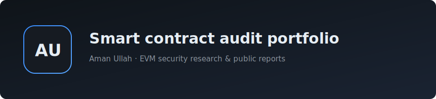

#

I’m Aman Ullah, a smart contract security researcher. I review EVM-based protocols for teams and in public security competitions, with attention to correctness, economic assumptions, and integration risk. This repo collects selected findings clients or programs have approved for public release.

Interested in working together? Reach me at 

### Contest Reports Solo

| Protocol | About | Platform | Link |
|------------------|-------|----------|------|
| Super DCA Liquidity Network | Super DCA Liquidity Network (Uniswap v4 hooks): dynamic fees, Curve-style DCA gauge emissions, and liquidity lockups for new listings | Sherlock  |  |
|USG - Tangent|USG is a debt collateralized stablecoin backed by productive LPs and yield-bearing assets from blue chip DeFi protocols.|Sherlock||
|Notional Exponent|Notional Exponent is a leveraged yield protocol. Notional Exponent enables users to borrow from Morpho to establish leveraged staking, leveraged PT, and leveraged liquidity strategies.|Sherlock||
|LEND|LEND is a cross chain lending protocol with real yield value extraction, from protocol, to holder. The audit will focus on the cross-chain functionalities within the LEND infrastructure.|Sherlock||
|Burve|Burve is a 16-token multi-swap for pegged assets launching on Berachain with rehypothecation yields, moving peg handling, an analytic stableswap solution, depeg-protection, and subset-LPing so users can limit themselves to tokens they feel safest in.|Sherlock||
|Notional Leveraged Vaults|This update creates a Leveraged Vault integration with Pendle where Notional users can take leverage to buy PT tokens. It also includes an update to existing vaults that allows incentives to be more flexibly managed.|Sherlock||
|Elfi|All assets are tradable. Ultra Portfolio Mode includes multi-assets margin, position & assets risk offset.|Sherlock||
|Tokensoft Distributor Contracts Update|Adding "Per Address" functionality to existing distribution contracts on Tokensoft's platform.|Sherlock||
|Liquid Staking|stake.link is a liquid delegated staking platform for Chainlink Staking, built by LinkPool, powered by node operators, and governed by the stake.link DAO to enable DeFi composability and broader participation in the Chainlink Network.|Codehawks||
|ArkProject: NFT Bridge|ArkProject is a liquidity layer for digital assets built on top of Starknet, uniting markets, empowering creators, and bridging the gap to mass adoption.|Codehawks||
|Tadle|Tadle offers decentralized pre-market infrastructure facilitating the bridging of liquidity between primary and secondary financial markets!|Codehawks||
|Sablier|Sablier is a permissionless ERC-20 token streaming protocol that enables vesting, payroll, and airdrops by locking funds in a contract and releasing them to recipients over time based on configurable parameters like duration and payment rate.|Codehawks||
|DittoETH|The system mints pegged assets (stablecoins) using an orderbook, using over-collateralized staked ETH.|Codehawks||
|symbioticfi-core|Symbiotic is a shared security protocol enabling decentralized networks to control and customize their own multi-asset restaking implementation.|Cantina||

---

### Contest Reports Team

| Protocol | About | Platform | Link |
|------------------|-------|----------|------|
| Liquidity Management | The Perpetual Vault Protocol is a DeFi leveraged-trading system on GMX that streamlines position management with automation and risk mitigation.| Codehawks  |  |
| Zaros Part2 | Zaros is a perpetuals DEX on Arbitrum (with Monad planned) that uses boosted (re)staking vaults to grow LP yield while aiming for a strong trading experience.| Codehawks  |  |
| QuantAMM | QuantAMM is a next generation DeFi protocol launching Blockchain Traded Funds (BTFs). | Codehawks  |  |