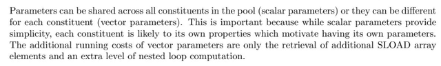

# Zaros

## Protocol Summary

Zaros is a Perpetuals DEX powered by Boosted (Re)Staking Vaults. It seeks to maximize LPs yield generation, while offering a top-notch trading experience on Arbitrum (and Monad in the future).

[Ethereum][Solidity][DeFi][Perpetuals][Dex]

---

### [H-01] The Deleverage Will apply twice on market USDtoken minting

#### Summary

When the `_fillOrder` is called we check that if the old position of user has some PNL, than we check that adjust profit and tries to find if any deleverage could be applied otherwise the PNL value will be provided `withdrawUsdTokenFromMarket`, the issue arises in case when deleverage factor could be applied in this case the `getAdjustedProfitForMarketId` returns the value on which we have applied the deleverage factor and pass that value to `withdrawUsdTokenFromMarket` which also applies Deleverage factor , so in this case the market will receive less usdToken than expected.

#### Vulnerability Details

let have a look on how the issue occurs:
first we will call fillOrder function which check that pnlUsdX18>0 , than we calls getAdjustedProfitForMarketId.

`/src/perpetuals/branches/SettlementBranch.sol:496`

```solidity
496:         if (ctx.pnlUsdX18.gt(SD59x18_ZERO)) {
497:             IMarketMakingEngine marketMakingEngine = IMarketMakingEngine(perpsEngineConfiguration.marketMakingEngine);
498: 
499:             ctx.marginToAddX18 =
500:                 marketMakingEngine.getAdjustedProfitForMarketId(marketId, ctx.pnlUsdX18.intoUD60x18().intoUint256());
501: 
502:             tradingAccount.deposit(perpsEngineConfiguration.usdToken, ctx.marginToAddX18);
503: 
504:             // mint settlement tokens credited to trader; tokens are minted to
505:             // address(this) since they have been credited to the trader's margin
506:             marketMakingEngine.withdrawUsdTokenFromMarket(marketId, ctx.marginToAddX18.intoUint256());
507:         }
508: 
```

The `getAdjustedProfitForMarketId` function will checks that if the deleverage factor could be applied in our case we assumes that it could be applied:

`/src/market-making/branches/CreditDelegationBranch.sol:129`

```solidity
129:     function getAdjustedProfitForMarketId(
130:         uint128 marketId,
131:         uint256 profitUsd
132:     )
133:         public
134:         view
135:         returns (UD60x18 adjustedProfitUsdX18)
136:     {
137:         // load the market's data storage pointer & cache total debt
138:         Market.Data storage market = Market.loadLive(marketId);
139:         SD59x18 marketTotalDebtUsdX18 = market.getTotalDebt();
140: 
141:         // caches the market's delegated credit & credit capacity
142:         UD60x18 delegatedCreditUsdX18 = market.getTotalDelegatedCreditUsd();
143:         SD59x18 creditCapacityUsdX18 = Market.getCreditCapacityUsd(delegatedCreditUsdX18, marketTotalDebtUsdX18);
144: 
145:         // if the credit capacity is less than or equal to zero then
146:         // the total debt has already taken all the delegated credit
147:         if (creditCapacityUsdX18.lte(SD59x18_ZERO)) {
148:             revert Errors.InsufficientCreditCapacity(marketId, creditCapacityUsdX18.intoInt256());
149:         }
150: 
151:         // uint256 -> UD60x18; output default case when market not in Auto Deleverage state
152:         adjustedProfitUsdX18 = ud60x18(profitUsd);
153: 
154:         // we don't need to add `profitUsd` as it's assumed to be part of the total debt
155:         // NOTE: If we don't return the adjusted profit in this if branch, we assume marketTotalDebtUsdX18 is positive
156:         if (market.isAutoDeleverageTriggered(delegatedCreditUsdX18, marketTotalDebtUsdX18)) {
157:             // if the market's auto deleverage system is triggered, it assumes marketTotalDebtUsdX18 > 0
158:             adjustedProfitUsdX18 =
159:                 market.getAutoDeleverageFactor(delegatedCreditUsdX18, marketTotalDebtUsdX18).mul(adjustedProfitUsdX18);
160:         }
161:     }
```

At Line 158 we can see that it will return the profit value on which the deleverage factor is already applied than we pass this value to `withdrawUsdTokenFromMarket` function which again applies this factor :

`/src/market-making/branches/CreditDelegationBranch.sol:249`

```solidity
249:     function withdrawUsdTokenFromMarket(uint128 marketId, uint256 amount) external onlyRegisteredEngine(marketId) {
250:         // loads the market's data and connected vaults
251:         Market.Data storage market = Market.loadLive(marketId);
252:         uint256[] memory connectedVaults = market.getConnectedVaultsIds();
253: 
254:         // once the unrealized debt is distributed update credit delegated
255:         // by these vaults to the market
256:         Vault.recalculateVaultsCreditCapacity(connectedVaults);
257: 
258:         // cache the market's total debt and delegated credit
259:         SD59x18 marketTotalDebtUsdX18 = market.getTotalDebt();
260:         UD60x18 delegatedCreditUsdX18 = market.getTotalDelegatedCreditUsd();
261: 
....
278:         // uint256 -> UD60x18
279:         // NOTE: we don't need to scale decimals here as it's known that USD Token has 18 decimals
280:         UD60x18 amountX18 = ud60x18(amount);
281: 
282:         // prepare the amount of usdToken that will be minted to the perps engine;
283:         // initialize to default non-ADL state
284:         uint256 amountToMint = amount;
...
288:         if (market.isAutoDeleverageTriggered(delegatedCreditUsdX18, marketTotalDebtUsdX18)) {
289:             // if the market is in the ADL state, it reduces the requested USD
290:             // Token amount by multiplying it by the ADL factor, which must be < 1
291:             UD60x18 adjustedUsdTokenToMintX18 =
292:                 market.getAutoDeleverageFactor(delegatedCreditUsdX18, marketTotalDebtUsdX18).mul(amountX18);
293: 
294:             amountToMint = adjustedUsdTokenToMintX18.intoUint256();
295:             market.updateNetUsdTokenIssuance(adjustedUsdTokenToMintX18.intoSD59x18());
....
305:         // mint USD Token to the perps engine
306:         UsdToken usdToken = UsdToken(marketMakingEngineConfiguration.usdTokenOfEngine[msg.sender]);
307:         usdToken.mint(msg.sender, amountToMint);
308: 
309:         // emit an event
310:         emit LogWithdrawUsdTokenFromMarket(msg.sender, marketId, amount, amountToMint);
311:     }
312: 
```

Here we can see Line 288 if `isAutoDeleverageTriggered` is true than we again apply deleveregae factor and mint that value to market.

#### Impact

Due to apllying twice delevereage factor the prep engine will receive less usdToken. So lose of funds for prep engine.

#### PoC

The following POC will proof it :

```solidity
    function test_WhenTheAutoDeleverageFactorIsTriggered(
        uint256 marketId
    )
        external
        whenTheMarketIsLive
        whenTheCreditCapacityIsGreaterThanZero
    {

                uint256 profitUsd= 10e18;

        PerpMarketCreditConfig memory fuzzMarketConfig = getFuzzPerpMarketCreditConfig(marketId);

        marketMakingEngine.workaround_setMarketUsdTokenIssuance(fuzzMarketConfig.marketId, 5e9 + 10);

        UD60x18 delegatedCreditUsdX18 =
            marketMakingEngine.workaround_getTotalDelegatedCreditUsd(fuzzMarketConfig.marketId);
        SD59x18 totalDebtUsdX18 = marketMakingEngine.workaround_getTotalMarketDebt(fuzzMarketConfig.marketId);

        UD60x18 autoDeleverageFactorX18 = marketMakingEngine.workaround_getAutoDeleverageFactor(
            fuzzMarketConfig.marketId, delegatedCreditUsdX18, totalDebtUsdX18
        );

        UD60x18 adjustedProfitUsdX18 =
            marketMakingEngine.getAdjustedProfitForMarketId(fuzzMarketConfig.marketId, profitUsd);
        console.log("adjustedProfitUsdX18" , adjustedProfitUsdX18.intoUint256());
        console.log("autoDeleverageFactorX18" , autoDeleverageFactorX18.intoUint256());

        uint256 balBefore = IERC20(usdToken).balanceOf(address(perpsEngine));
        // it should return the adjusted profit
        // applying the Deleveraging factor we exepect to mint this much adjustedProfitUsdX18 to market 
        assertEq(ud60x18(profitUsd).mul(autoDeleverageFactorX18).intoUint256(), adjustedProfitUsdX18.intoUint256());
        changePrank({ msgSender:address(perpsEngine)});
        marketMakingEngine.withdrawUsdTokenFromMarket(fuzzMarketConfig.marketId, adjustedProfitUsdX18.intoUint256());
        uint256 balAfter = IERC20(usdToken).balanceOf(address(perpsEngine));

        assertNotEq(adjustedProfitUsdX18.intoUint256(),balAfter - balBefore);
        // but the code apply deleverage twice
             adjustedProfitUsdX18 = adjustedProfitUsdX18.mul(autoDeleverageFactorX18);
        assertEq(adjustedProfitUsdX18.intoUint256(),balAfter - balBefore);

    }
```

Add the above test in `CreditDelegationBranch_GetAdjustedProfitForMarketId_Integration_Test` test contract and run with command:

`forge test --mt test_WhenTheAutoDeleverageFactorIsTriggered -vvv`

Tools used: Manual Review.

#### Mitigation

Pass the exact PNL value to `withdrawUsdTokenFromMarket` or remove the deleverage factor calculation for `withdrawUsdTokenFromMarket` function.

---
### [H-02] User can bypass the uplift Fee via transfer token to others


#### Summary
When users add liquidity through the uplift Router/hook contract, they are charged an uplift fee if the price increases after their deposit. However, this fee can be bypassed by transferring the NFT to another address and then withdrawing liquidity, which only incurs the withdrawal fee instead of the uplift fee.

#### Vulnerability Details
When a user deposits or adds liquidity, an NFT is minted for the user, and the router stores the current USD value of the assets along with the amount of their BPT tokens.

`contracts/hooks-quantamm/UpliftOnlyExample.sol:220`
```solidity
220:     function addLiquidityProportional(
221:         address pool,
222:         uint256[] memory maxAmountsIn,
223:         uint256 exactBptAmountOut,
224:         bool wethIsEth,
225:         bytes memory userData
226:     ) external payable saveSender(msg.sender) returns (uint256[] memory amountsIn) { 
228:         if (poolsFeeData[pool][msg.sender].length > 100) {
229:             revert TooManyDeposits(pool, msg.sender);
230:         }
231:         // Do addLiquidity operation - BPT is minted to this contract.
232:         amountsIn = _addLiquidityProportional(
233:             pool,
234:             msg.sender,
235:             address(this),
236:             maxAmountsIn,
237:             exactBptAmountOut,
238:             wethIsEth,
239:             userData
240:         );
241: 
242:         uint256 tokenID = lpNFT.mint(msg.sender);
243: 
244:         //this requires the pool to be registered with the QuantAMM update weight runner
245:         //as well as approved with oracles that provide the prices
246:         uint256 depositValue = getPoolLPTokenValue(
247:             IUpdateWeightRunner(_updateWeightRunner).getData(pool),
248:             pool,
249:             MULDIRECTION.MULDOWN
250:         );
251: 
252:         poolsFeeData[pool][msg.sender].push(
253:             FeeData({
254:                 tokenID: tokenID,
255:                 amount: exactBptAmountOut,
256:                 //this rounding favours the LP
257:                 lpTokenDepositValue: depositValue, // 0.5e18
258:                 //known use of timestamp, caveats are known.
259:                 blockTimestampDeposit: uint40(block.timestamp),
260:                 upliftFeeBps: upliftFeeBps
261:             })
262:         );
263: 
264:         nftPool[tokenID] = pool;
265:     }
```
When a user withdraws liquidity from the pool, an uplift fee is charged if the price has increased. However, this fee can be bypassed by transferring the NFT to another account. Below, we examine the function that handles NFT transfers:

`contracts/hooks-quantamm/UpliftOnlyExample.sol:579`
```solidity
579:     function afterUpdate(address _from, address _to, uint256 _tokenID) public {
580:         if (msg.sender != address(lpNFT)) {
581:             revert TransferUpdateNonNft(_from, _to, msg.sender, _tokenID);
582:         }
583: 
584:         address poolAddress = nftPool[_tokenID];
585: 
586:         if (poolAddress == address(0)) {
587:             revert TransferUpdateTokenIDInvaid(_from, _to, _tokenID);
588:         }
589: 
590:         int256[] memory prices = IUpdateWeightRunner(_updateWeightRunner).getData(poolAddress);
591:         uint256 lpTokenDepositValueNow = getPoolLPTokenValue(prices, poolAddress, MULDIRECTION.MULDOWN);
592: 
593:         FeeData[] storage feeDataArray = poolsFeeData[poolAddress][_from]; // 1 entry 
...
610: 
611:         if (tokenIdIndexFound) {
612:             if (_to != address(0)) {
613:                 // Update the deposit value to the current value of the pool in base currency (e.g. USD) and the block index to the current block number
614:                 //vault.transferLPTokens(_from, _to, feeDataArray[i].amount);
615:                 feeDataArray[tokenIdIndex].lpTokenDepositValue = lpTokenDepositValueNow;
616:                 feeDataArray[tokenIdIndex].blockTimestampDeposit = uint32(block.number);
617:                 feeDataArray[tokenIdIndex].upliftFeeBps = upliftFeeBps;
618: 
619:                 //actual transfer not a afterTokenTransfer caused by a burn
620:                 poolsFeeData[poolAddress][_to].push(feeDataArray[tokenIdIndex]); 
...
633:         }
634:     }
635: 
```
From the code above, it is evident that the lpTokenDepositValue is only updated to reflect the latest price, and the FeeData is stored for the receiver. Consequently, when a user withdraws, only the withdrawal fee will be applied.

Breakdown of the removeLiquidity Function:
During the withdrawal process, the current price is fetched and compared with the stored USD value.

If the difference is greater than 0, the uplift fee is applied.

Otherwise, only the withdrawal fee is charged.


`contracts/hooks-quantamm/UpliftOnlyExample.sol:434`
```solidity
434:     function onAfterRemoveLiquidity(
435:         address router,
436:         address pool,
437:         RemoveLiquidityKind,
438:         uint256 bptAmountIn,
439:         uint256[] memory,
440:         uint256[] memory amountsOutRaw,
441:         uint256[] memory,
442:         bytes memory userData
443:     ) public override onlySelfRouter(router) returns (bool, uint256[] memory hookAdjustedAmountsOutRaw) {
444:         address userAddress = address(bytes20(userData));
...
465:         // We only allow removeLiquidity via the Router/Hook itself so that fee is applied correctly.
466:         hookAdjustedAmountsOutRaw = amountsOutRaw;
467: 
468:         //this rounding faxvours the LP
469:         localData.lpTokenDepositValueNow = getPoolLPTokenValue(localData.prices, pool, MULDIRECTION.MULDOWN);
470: 
471:         FeeData[] storage feeDataArray = poolsFeeData[pool][userAddress];
472:         localData.feeDataArrayLength = feeDataArray.length;
473:         localData.amountLeft = bptAmountIn;
474:         for (uint256 i = localData.feeDataArrayLength - 1; i >= 0; --i) {
475:             localData.lpTokenDepositValue = feeDataArray[i].lpTokenDepositValue;
477: 
478:             localData.lpTokenDepositValueChange =
479:                 (int256(localData.lpTokenDepositValueNow) - int256(localData.lpTokenDepositValue)) /
480:                 int256(localData.lpTokenDepositValue);// @note : it returns values in bps so upto 0.9 e18 change can be 
481:             uint256 feePerLP;
482:             // if the pool has increased in value since the deposit, the fee is calculated based on the deposit value
483:             if (localData.lpTokenDepositValueChange > 0) { // @note : it will not work with bps less than 1
485:                 feePerLP =
486:                     (uint256(localData.lpTokenDepositValueChange) * (uint256(feeDataArray[i].upliftFeeBps) * 1e18)) /
487:                     10000;
488:             }
489:             // if the pool has decreased in value since the deposit, the fee is calculated based on the base value - see wp
490:             else {
491:                 //in most cases this should be a normal swap fee amount.
492:                 //there always myst be at least the swap fee amount to avoid deposit/withdraw attack surgace.
493:                 feePerLP = (uint256(minWithdrawalFeeBps) * 1e18) / 10000;
494:             
}
```
Steps to Bypass Uplift Fee
Initial Deposit: Alice deposits 10 WETH at a price of $3000. The stored lpTokenDepositValue is set to $30,000\.

Price Increase: The price of WETH increases to $3400. If Alice withdraws, the uplift fee will be applied.

NFT Transfer: Alice transfers the NFT to another address. The stored lpTokenDepositValue is updated to $34,000.

Withdrawal: Alice calls the removeLiquidityProportional function. Since the current USD value and the stored USD value are the same, no uplift fee is applied.

#### Impact
The user can bypass the uplift fee by transferring the NFT to another address. and the Withdrawal Fee according to current config is less than uplift fee.


Tools used: Manual Review.


#### Mitigation
When a user transfers the NFT, the best approach would be to apply the uplift fee if the price has increased.

---

### [M-01] Due to not updating the Debt , the protocol will apply untended premium or discount

#### Summary
When market receive profit we call the depositCreditForMarket than we update the relevant collateral state , which will be applied to all the connected vaults of this market , in case of swapping of usd tokens with the vault assets. we apply premium/discount factor, depending on the state of vault either profit or lose.However the State of connected vaults were not updated in these calls which will effect the the discountPremiumFactor of vault. further details in next section.

#### Vulnerability Details
Here I focused on collateralAddr==usdc. when market receive funds we will call settleCreditDeposit :

```solidity
/src/market-making/branches/CreditDelegationBranch.sol:181
181:     function depositCreditForMarket(
182:         uint128 marketId,
183:         address collateralAddr,
184:         uint256 amount
185:     )
186:         external
187:         onlyRegisteredEngine(marketId)
188:     {
189:         if (amount == 0) revert Errors.ZeroInput("amount");
190: 
191:         // loads the collateral's data storage pointer, must be enabled
192:         Collateral.Data storage collateral = Collateral.load(collateralAddr);
193:         collateral.verifyIsEnabled();
194: 
195:         // loads the market's data storage pointer, must have delegated credit so
196:         // engine is not depositing credit to an empty distribution (with 0 total shares)
197:         // although this should never happen if the system functions properly.
198:         Market.Data storage market = Market.loadLive(marketId);
199:         if (market.getTotalDelegatedCreditUsd().isZero()) {
200:             revert Errors.NoDelegatedCredit(marketId);
201:         }
202: 
203:         // uint256 -> UD60x18 scaling decimals to zaros internal precision
204:         UD60x18 amountX18 = collateral.convertTokenAmountToUd60x18(amount);
205: 
206:         // caches the usdToken address
207:         address usdToken = MarketMakingEngineConfiguration.load().usdTokenOfEngine[msg.sender];
208: 
209:         // caches the usdc
210:         address usdc = MarketMakingEngineConfiguration.load().usdc;
211:         // note: storage updates must occur using zaros internal precision
212:         if (collateralAddr == usdToken) {
213:             // if the deposited collateral is USD Token, it reduces the market's realized debt
214:             market.updateNetUsdTokenIssuance(unary(amountX18.intoSD59x18()));
215:         } else {
216:             if (collateralAddr == usdc) {
217:                 market.settleCreditDeposit(address(0), amountX18);
218:             } else {
219:                 // deposits the received collateral to the market to be distributed to vaults
220:                 // to be settled in the future
221:                 market.depositCredit(collateralAddr, amountX18);
222:             }
223:         }
224:         // transfers the margin collateral asset from the registered engine to the market making engine
225:         // NOTE: The engine must approve the market making engine to transfer the margin collateral asset, see
226:         // PerpsEngineConfigurationBranch::setMarketMakingEngineAllowance
227:         // note: transfers must occur using token native precision
228:         IERC20(collateralAddr).safeTransferFrom(msg.sender, address(this), amount);
229:         // emit an event
230:         emit LogDepositCreditForMarket(msg.sender, marketId, collateralAddr, amount);
231:     }
```
in settleCreditDeposit function we update usdcCreditPerVaultShare and realizedDebtUsdPerVaultShare.

```solidity
/src/market-making/leaves/Market.sol:444
444:     function settleCreditDeposit(Data storage self, address settledAsset, UD60x18 netUsdcReceivedX18) internal {
445:         // removes the credit deposit asset that has just been settled for usdc
446:         self.creditDeposits.remove(settledAsset);
447: 
448:         // calculate the usdc that has been accumulated per usd of credit delegated to the market
449:         UD60x18 addedUsdcPerCreditShareX18 = netUsdcReceivedX18.div(ud60x18(self.totalDelegatedCreditUsd));
450: 
451:         // add the usdc acquired to the accumulated usdc credit variable
452:         self.usdcCreditPerVaultShare =
453:             ud60x18(self.usdcCreditPerVaultShare).add(addedUsdcPerCreditShareX18).intoUint128();
454: 
455:         // deduct the amount of usdc credit from the realized debt per vault share, so we don't double count it
456:         self.realizedDebtUsdPerVaultShare = sd59x18(self.realizedDebtUsdPerVaultShare).sub(
457:             addedUsdcPerCreditShareX18.intoSD59x18()
458:         ).intoInt256().toInt128();
459: 
460:     }
```
realizedDebtUsdPerVaultShare is important to find that the vault is in credit or debt.
```solidity
/src/market-making/leaves/Vault.sol:278
278:     function _recalculateConnectedMarketsState(
279:         Data storage self,
280:         uint128[] memory connectedMarketsIdsCache,
281:         bool shouldRehydrateCache
282:     )
283:         private
284:         returns (
285:             uint128[] memory rehydratedConnectedMarketsIdsCache,
286:             SD59x18 vaultTotalRealizedDebtChangeUsdX18,
287:             SD59x18 vaultTotalUnrealizedDebtChangeUsdX18,
288:             UD60x18 vaultTotalUsdcCreditChangeX18,
289:             UD60x18 vaultTotalWethRewardChangeX18
290:         )
291:     {
...
330:             // prevent division by zero
331:             if (!market.getTotalDelegatedCreditUsd().isZero()) {
332:                 // get the vault's accumulated debt, credit and reward changes from the market to update its stored
333:                 // values
334:                 (
335:                     ctx.realizedDebtChangeUsdX18,
336:                     ctx.unrealizedDebtChangeUsdX18,
337:                     ctx.usdcCreditChangeX18,
338:                     ctx.wethRewardChangeX18
339:                 ) = market.getVaultAccumulatedValues(
340:                     ud60x18(creditDelegation.valueUsd),
341:                     sd59x18(creditDelegation.lastVaultDistributedRealizedDebtUsdPerShare),
342:                     sd59x18(creditDelegation.lastVaultDistributedUnrealizedDebtUsdPerShare),
343:                     ud60x18(creditDelegation.lastVaultDistributedUsdcCreditPerShare),
344:                     ud60x18(creditDelegation.lastVaultDistributedWethRewardPerShare)
345:                 );
346:             }
...
350:             if (
351:                 ctx.realizedDebtChangeUsdX18.isZero() && ctx.unrealizedDebtChangeUsdX18.isZero()
352:                     && ctx.usdcCreditChangeX18.isZero() && ctx.wethRewardChangeX18.isZero()
353:             ) {
354:                 continue; // skip the iteration
355:             }
356: 
...
371:             // update the last distributed debt, credit and reward values to the vault's credit delegation to the
372:             // given market id, in order to keep next calculations consistent
373:             creditDelegation.updateVaultLastDistributedValues(
374:                 sd59x18(market.realizedDebtUsdPerVaultShare),
375:                 sd59x18(market.unrealizedDebtUsdPerVaultShare),
376:                 ud60x18(market.usdcCreditPerVaultShare),
377:                 ud60x18(market.wethRewardPerVaultShare)
378:             );
379:         }
380:     }
```
This function will update realizedDebtUsdPerVaultShare per vault.
To find the getAmountOfAssetOut we first get the getTotalDebt() of vault than we passed that debt to getPremiumDiscountFactor function.

```solidity
/src/market-making/branches/StabilityBranch.sol:100
100:     function getAmountOfAssetOut(
101:         uint128 vaultId,
102:         UD60x18 usdAmountInX18,
103:         UD60x18 indexPriceX18
104:     )
105:         public
106:         view
107:         returns (UD60x18 amountOutX18)
108:     {
109:         // fetch the vault's storage pointer
110:         Vault.Data storage vault = Vault.load(vaultId);
111: 
112:         // fetch the vault's total assets in USD; if the vault is empty
113:         // revert here to prevent panic from subsequent divide by zero
114:         UD60x18 vaultAssetsUsdX18 = ud60x18(IERC4626(vault.indexToken).totalAssets()).mul(indexPriceX18);
115:         if (vaultAssetsUsdX18.isZero()) revert Errors.InsufficientVaultBalance(vaultId, 0, 0);
116: 
117:         // we use the vault's net sum of all debt types coming from its connected markets to determine the swap rate
118:         SD59x18 vaultDebtUsdX18 = vault.getTotalDebt(); // this is zero but why ?
119: 
120:         // calculate the premium or discount that may be applied to the vault asset's index price
121:         // note: if no premium or discount needs to be applied, the premiumDiscountFactorX18 will be
122:         // 1e18 (UD60x18 one value)
123:         UD60x18 premiumDiscountFactorX18 =
124:             UsdTokenSwapConfig.load().getPremiumDiscountFactor(vaultAssetsUsdX18, vaultDebtUsdX18);
125: 
126:         // get amounts out taking into consideration the CL price and the premium/discount
127:         amountOutX18 = usdAmountInX18.div(indexPriceX18).mul(premiumDiscountFactorX18);
130: 
131:     }
```
getTotalDebt will return the debt of a vault on basis of this than we will either apply discount or premium.
```solidity
/src/market-making/leaves/Vault.sol:227
227:     function getTotalDebt(Data storage self) internal view returns (SD59x18 totalDebtUsdX18) {
228:         totalDebtUsdX18 = getUnsettledRealizedDebt(self).add(sd59x18(self.marketsUnrealizedDebtUsd));
229:     }
....
241:     function getUnsettledRealizedDebt(Data storage self)
242:         internal
243:         view
244:         returns (SD59x18 unsettledRealizedDebtUsdX18)
245:     {
246:         unsettledRealizedDebtUsdX18 =
247:             sd59x18(self.marketsRealizedDebtUsd).add(unary(ud60x18(self.depositedUsdc).intoSD59x18()));
248:     }
```
So now lets have a look on how we calculate the getPremiumDiscountFactor.
```solidity
    function getPremiumDiscountFactor(
        Data storage self,
        UD60x18 vaultAssetsValueUsdX18,
        SD59x18 vaultDebtUsdX18
    )
        internal
        view
        returns (UD60x18 premiumDiscountFactorX18)
    {
        // calculate the vault's tvl / debt absolute value, positive means we'll apply a discount, negative means
        // we'll apply a premium

        // console.log("vaultDebtUsdX18--------++++++++++++++++++++",vaultDebtUsdX18.intoUint256(),vaultAssetsValueUsdX18.intoUint256());
        UD60x18 vaultDebtTvlRatioAbs = vaultDebtUsdX18.abs().intoUD60x18().div(vaultAssetsValueUsdX18);

        // cache the minimum x value of the premium / discount curve
        UD60x18 pdCurveXMinX18 = ud60x18(0.1e18);//ud60x18(self.pdCurveXMin);
        // cache the maximum x value of the premium / discount curve
        UD60x18 pdCurveXMaxX18 =ud60x18(0.8e18); //ud60x18(self.pdCurveXMax);

        // if the vault's debt / tvl ratio is less than or equal to the minimum x value of the premium / discount
        // curve, then we don't apply any premium or discount
        if (vaultDebtTvlRatioAbs.lte(pdCurveXMinX18)) {
            premiumDiscountFactorX18 = UD60x18_UNIT;
            return premiumDiscountFactorX18;
        }

        // if the vault's debt / tvl ratio is greater than or equal to the maximum x value of the premium / discount
        // curve, we use the max X value, otherwise, use the calculated vault tvl / debt ratio
        UD60x18 pdCurveXX18 = vaultDebtTvlRatioAbs.gte(pdCurveXMaxX18) ? pdCurveXMaxX18 : vaultDebtTvlRatioAbs;

        // cache the minimum y value of the premium / discount curve
        UD60x18 pdCurveYMinX18 = ud60x18(0.3e18);//ud60x18(self.pdCurveYMin);
        // cache the maximum y value of the premium / discount curve
        UD60x18 pdCurveYMaxX18 = ud60x18(0.9e18);//ud60x18(self.pdCurveYMax);

        // cache the exponent that determines the steepness of the premium / discount curve
        UD60x18 pdCurveZX18 = ud60x18(0.6e18);//ud60x18(self.pdCurveZ);
        // calculate the y point of the premium or discount curve given the x point
        UD60x18 pdCurveYX18 = pdCurveYMinX18.add(
            pdCurveYMaxX18.sub(pdCurveYMinX18).mul(
                pdCurveXX18.sub(pdCurveXMinX18).div(pdCurveXMaxX18.sub(pdCurveXMinX18)).pow(pdCurveZX18)
            )
        );
        // if the vault is in credit, we apply a discount, otherwise, we apply a premium
        premiumDiscountFactorX18 =
            vaultDebtUsdX18.lt(SD59x18_ZERO) ? UD60x18_UNIT.sub(pdCurveYX18) : UD60x18_UNIT.add(pdCurveYX18);
    }

```
Note Here I have assigned dummy data to pdCurveXMinX18 , pdCurveXMaxX18 , pdCurveYMinX18 , pdCurveYMaxX18 and pdCurveZX18 because if not it will revert which is separate issue i have submitted.

So now lets just wrap it:
Assume the vault is in +debt , we deposit USDC to the market which will give us new value of self.realizedDebtUsdPerVaultShare and self.usdcCreditPerVaultShare which we were suppose to apply to the all vaults connect with this market but we are not doing it for impact see the impact section of report. The only calls to the function updateVaultCreditCapacity will not fix this because the lastVaultDistributedRealizedDebtUsdPerShareX18 will be zero and no changes would be applied to the vault.
```solidity
/src/market-making/leaves/Market.sol:303
303:         realizedDebtChangeUsdX18 = !lastVaultDistributedRealizedDebtUsdPerShareX18.isZero()
304:          ?sd59x18(self.realizedDebtUsdPerVaultShare).sub(lastVaultDistributedRealizedDebtUsdPerShareX18).mul(vaultCreditShareX18.intoSD59x18())
305:             : SD59x18_ZERO;
306: 
```

#### Impact

The vault will still give discount or charge premium due not not updating the vault debt state. it will result in lose for vault in case the vault is in credit or vice versa.

Tools used: Manual Review.

#### PoC
I have assume few things for POC :

Add dummy value to the function getPremiumDiscountFactor you can copy it from above section.

Called the receiveMarketFee function so that subsequent call to updateVaultCreditCapacity will apply latest changes to the vault.
```solidity
      function test_depositCreditForMarket_state_no_update(  
     
    )
        external
        whenCallerIsKeeper
        whenRequestWasNotYetProcessed
        whenSwapRequestNotExpired
    {
        uint256 vaultId = 100;
        uint256 marketId = 100;
        uint256 vaultAssetsBalance = 5000e16;
        uint256 swapAmount = 1000e6;
        uint128 vaultDebtAbsUsd = uint128(2e18);
        bool useCredit= false;
        TestFuzz_WhenSlippageCheckPassesAndThePremiumOrDiscountIsNotZero_Context memory ctx;

        ctx.fuzzVaultConfig = getFuzzVaultConfig(vaultId);

        ctx.oneAsset = 10 ** ctx.fuzzVaultConfig.decimals;

        changePrank({ msgSender: users.owner.account });
        marketMakingEngine.configureUsdTokenSwapConfig(1, 30, type(uint96).max);
        marketMakingEngine.workaround_setVaultDebt(uint128(ctx.fuzzVaultConfig.vaultId),int128(vaultDebtAbsUsd));
        marketMakingEngine.workaround_setVaultDepositedUsdc(uint128(ctx.fuzzVaultConfig.vaultId),0);
        marketMakingEngine.configureEngine(address(marketMakingEngine), address(newUSDToken), true);

        changePrank({ msgSender: users.naruto.account });

        // bound the vault assets balance to be between 1 asset unit and the deposit cap
        // vaultAssetsBalance = bound({ x: vaultAssetsBalance, min: ctx.oneAsset, max: ctx.fuzzVaultConfig.depositCap });

        // bound the vault's total credit or debt
        // vaultDebtAbsUsd = bound({ x: vaultDebtAbsUsd, min: ctx.oneAsset / 2, max: vaultAssetsBalance });
        console.log("----------vaultDebtAbsUsd-----------",vaultDebtAbsUsd);
        deal({
            token: address(ctx.fuzzVaultConfig.asset),
            to: ctx.fuzzVaultConfig.indexToken,
            give: vaultAssetsBalance
        });

        swapAmount = vaultAssetsBalance;
                console.log("---------------swapAmount---------------",swapAmount);

        deal({ token: address(usdToken), to: users.naruto.account, give: swapAmount });

        ctx.fuzzPerpMarketCreditConfig = getFuzzPerpMarketCreditConfig(marketId);
        ctx.engine = IMockEngine(perpMarketsCreditConfig[ctx.fuzzPerpMarketCreditConfig.marketId].engine);
        ctx.minAmountOut = 0;
        UD60x18 priceUsdX18 = IPriceAdapter(vaultsConfig[ctx.fuzzVaultConfig.vaultId].priceAdapter).getPrice();

        ctx.priceData = getMockedSignedReport(ctx.fuzzVaultConfig.streamId, priceUsdX18.intoUint256());
        ctx.usdTokenSwapKeeper = usdTokenSwapKeepers[ctx.fuzzVaultConfig.asset];
        
        deal({ token: address(usdc), to: address(ctx.engine), give: 10_000e30});
        changePrank({ msgSender: address(ctx.engine) });
        
        uint256 marketFees = 1_000_000_000_000_000_000;
                IERC20 wethFeeToken = IERC20(getFuzzVaultConfig(WETH_CORE_VAULT_ID).asset);
        deal({ token: address(wethFeeToken), to: address(ctx.engine), give: marketFees });

        changePrank({ msgSender: address((ctx.engine)) });

         marketMakingEngine.depositCreditForMarket(ctx.fuzzPerpMarketCreditConfig.marketId,address(usdc),1_000_000_000_000_000);
         marketMakingEngine.receiveMarketFee(ctx.fuzzPerpMarketCreditConfig.marketId, address(wethFeeToken), marketFees);//@audit added just to proof that if state update occur the received assets will be different
         marketMakingEngine.depositCreditForMarket(ctx.fuzzPerpMarketCreditConfig.marketId,address(usdc),1_000_000_000_000_000_00);
         UD60x18 positveDebtAmountOut =
            marketMakingEngine.getAmountOfAssetOut(ctx.fuzzVaultConfig.vaultId, ud60x18(swapAmount), priceUsdX18);

        //  marketMakingEngine.updateVaultCreditCapacity(ctx.fuzzVaultConfig.vaultId);// uncomment it to see the revert if the update applies it will work as expected
        UD60x18 negativeDebtAmountOut =
            marketMakingEngine.getAmountOfAssetOut(ctx.fuzzVaultConfig.vaultId, ud60x18(swapAmount), priceUsdX18);
        console.log("+veCase" , positveDebtAmountOut.intoUint256());
        console.log("-veCase" , negativeDebtAmountOut.intoUint256());
        assertEq(positveDebtAmountOut.intoUint256() , negativeDebtAmountOut.intoUint256()); // @audit it still gives discount instead of charging premium
    }
```
run with command : forge test --mt test_depositCreditForMarket_state -vvvv.
In the above case, both values are equal, indicating that the vault still applies a discount even though it is supposed to charge a premium. To test other scenarios, uncomment updateVaultCreditCapacity.

#### Mitigation
The Fix for the issue lies in these two functions :

getVaultAccumulatedValues

depositCreditForMarket
For getVaultAccumulatedValues following fix is recommended:
```diff
diff --git a/src/market-making/leaves/Market.sol b/src/market-making/leaves/Market.sol
index d094374..aab3bb5 100644
--- a/src/market-making/leaves/Market.sol
+++ b/src/market-making/leaves/Market.sol
@@ -299,11 +299,9 @@ library Market {
         // note: if the last distributed value is zero, we assume it's the first time the vault is accumulating
         // values, thus, it needs to return zero changes
         // console.log("lastVaultDistributedRealizedDebtUsdPerShareX18------------",lastVaultDistributedRealizedDebtUsdPerShareX18.intoInt256());
-        realizedDebtChangeUsdX18 = !lastVaultDistributedRealizedDebtUsdPerShareX18.isZero()
-            ? realizedDebtChangeUsdX18
-            : SD59x18_ZERO;
+    //    realizedDebtChangeUsdX18 =  ;
+        realizedDebtChangeUsdX18 = sd59x18(self.realizedDebtUsdPerVaultShare).sub(lastVaultDistributedRealizedDebtUsdPerShareX18).mul(vaultCreditShareX18.intoSD59x18());
+            // : SD59x18_ZERO;
```
Add the Following changes to CreditDelegationBranch
```diff
diff --git a/src/market-making/branches/CreditDelegationBranch.sol b/src/market-making/branches/CreditDelegationBranch.sol
index c3e04fa..9cefa39 100644
--- a/src/market-making/branches/CreditDelegationBranch.sol
+++ b/src/market-making/branches/CreditDelegationBranch.sol
@@ -208,11 +208,9 @@ contract CreditDelegationBranch is EngineAccessControl {
 
         // caches the usdc
         address usdc = MarketMakingEngineConfiguration.load().usdc; 
         // note: storage updates must occur using zaros internal precision
         if (collateralAddr == usdToken) {
             // if the deposited collateral is USD Token, it reduces the market's realized debt
             market.updateNetUsdTokenIssuance(unary(amountX18.intoSD59x18())); // @note -amountX18
         } else {
@@ -229,6 +227,9 @@ contract CreditDelegationBranch is EngineAccessControl {
         // PerpsEngineConfigurationBranch::setMarketMakingEngineAllowance
         // note: transfers must occur using token native precision
         IERC20(collateralAddr).safeTransferFrom(msg.sender, address(this), amount);
+
+        Vault.recalculateVaultsCreditCapacity(market.getConnectedVaultsIds());
+
         // emit an event
         emit LogDepositCreditForMarket(msg.sender, marketId, collateralAddr, amount);
     }
```
---

### [M-02] Frontrunning `receiveMarketFee` Allows Attackers to Claim Fees and Unstake Shares

#### Summary
An attacker can frontrun the receiveMarketFee call to stake just before fees are distributed, allowing them to claim an equal share of rewards as legitimate stakers without actually contributing to the pool for a meaningful duration.

#### Vulnerability Details
Let say a valid user deposits and stakes assets in the vault. the user stake share gets updated.
```solidity
/src/market-making/branches/VaultRouterBranch.sol:414
414:         UD60x18 updatedActorShares = ud60x18(actor.shares).add(ud60x18(shares));
415: 
416:         // update actor staked shares
417:         wethRewardDistribution.setActorShares(actorId, updatedActorShares);
```
The receiveMarketFee call Receives collateral as a fee for processing and this fee later will be converted to WETH and sent to beneficiaries. i.e. feeRecipients and the stakers.
```solidity
/src/market-making/branches/FeeDistributionBranch.sol:392
392:         // adds the weth received for protocol and vaults rewards using the assets previously paid by the engine
393:         // as fees, and remove its balance from the market's `receivedMarketFees` map
394:         market.receiveWethReward(assetOut, receivedProtocolWethRewardX18, receivedVaultsWethRewardX18);
395: 
396:         // recalculate markes' vaults credit delegations after receiving fees to push reward distribution
397:         Vault.recalculateVaultsCreditCapacity(market.getConnectedVaultsIds());
```
In the recalculateVaultsCreditCapacity function, distributeValue is called.

```solidity

/src/market-making/leaves/Vault.sol:448
448:             if (!vaultTotalWethRewardChangeX18.isZero() && self.wethRewardDistribution.totalShares != 0) {
449:                 SD59x18 vaultTotalWethRewardChangeSD59X18 =
450:                     sd59x18(int256(vaultTotalWethRewardChangeX18.intoUint256()));
451:                 self.wethRewardDistribution.distributeValue(vaultTotalWethRewardChangeSD59X18);
452:             }
```
In the distributeValue function the valuePerShare value get updated.
```solidity

/src/market-making/leaves/Distribution.sol:28
28:     function distributeValue(Data storage self, SD59x18 value) internal {
29:         if (value.eq(SD59x18_ZERO)) {
30:             return;
31:         }
32: 
33:         UD60x18 totalShares = ud60x18(self.totalShares);
34: 
35:         if (totalShares.eq(UD60x18_ZERO)) {
36:             revert Errors.EmptyDistribution();
37:         }
38: 
39:         SD59x18 deltaValuePerShare = value.div(totalShares.intoSD59x18()); // 100e18/80e18 => 20 token stake => 100e18 => 1e18
40: 
41:         self.valuePerShare = sd59x18(self.valuePerShare).add(deltaValuePerShare).intoInt256(); // 1e18
42:     }
```
The attacker saw that the receiveMarketFee is being executed. Attacker stakes just before receiveMarketFee is executed.

Since fees are distributed based on current stake share, the attacker gets an equal share despite minimal participation. Fees are distributed to both the legitimate user and the attacker.

The attacker immediately claims their share by calling claimFees. The claimFees calls getActorValueChange which internally calls _getActorValueChange
```solidity

/src/market-making/leaves/Distribution.sol:106
106:     function _getActorValueChange(
107:         Data storage self,
108:         Actor storage actor
109:     )
110:         private
111:         view
112:         returns (SD59x18 valueChange)
113:     {
114:         //@audit check for edge cases where user can still claim fees after complete withdrawal.
115:         SD59x18 deltaValuePerShare = sd59x18(self.valuePerShare).sub(sd59x18(actor.lastValuePerShare));
116:         valueChange = deltaValuePerShare.mul(ud60x18(actor.shares).intoSD59x18());
117:     }
```
The attacker unstakes and exits, having earned rewards unfairly.

#### Impact

Unfair fee distribution: Attackers earn rewards without real staking contribution.

Potential fund depletion: Repeated exploitation can drain legitimate stakers’ rewards.

Tools used: Manual Review, Unit Testing.

#### PoC

`/test/integration/market-making/fee-distribution-branch/claimFees/claimFees.t.sol:477`

```solidity
478:    function test_stake_frontrun_reward_poc() external { // @audit POC 
479:         // ensure valid vault and load vault config
480:         uint128 vaultId = WETH_CORE_VAULT_ID;
481:         VaultConfig memory fuzzVaultConfig = getFuzzVaultConfig(vaultId);
482: 
483:         // ensure valid deposit amount and perform the deposit
484:         address user = users.naruto.account;
485:         address attacker = users.sasuke.account;
486:         
487:         uint128 assetsToDeposit = uint128(calculateMinOfSharesToStake(vaultId));
488:         fundUserAndDepositInVault(user, vaultId, assetsToDeposit);
489: 
490:         // save and verify pre state
491:         ClaimFeesState memory pre1 =
492:             _getClaimFeesState(user, vaultId, IERC20(fuzzVaultConfig.asset), IERC20(fuzzVaultConfig.indexToken));
493:       
494:         // perform the stake
495:         vm.startPrank(user);
496:         marketMakingEngine.stake(vaultId, pre1.stakerVaultBal);
497:         
498:         vm.warp(block.timestamp + 1 days); // user stake for 1 day
499: 
500:         uint128 attackerAssetsToDeposit = uint128(calculateMinOfSharesToStake(vaultId));
501:         fundUserAndDepositInVault(attacker, vaultId, attackerAssetsToDeposit);
502: 
503:        ClaimFeesState memory pre2 =
504:             _getClaimFeesState(attacker, vaultId, IERC20(fuzzVaultConfig.asset), IERC20(fuzzVaultConfig.indexToken));
505:       
506:         // perform the stake by attacker
507:         vm.startPrank(attacker);
508:         marketMakingEngine.stake(vaultId, pre2.stakerVaultBal);
509:         
510: 
511:         assertEq(pre2.stakerShares, pre1.stakerShares);
512: 
513: 
514:         // sent WETH market fees from PerpsEngine -> MarketEngine
515:         uint256 marketFees = 1_000_000_000_000_000_000;
516:         deal(fuzzVaultConfig.asset, address(perpMarketsCreditConfig[ETH_USD_MARKET_ID].engine), marketFees);
517:         changePrank({ msgSender: address(perpMarketsCreditConfig[ETH_USD_MARKET_ID].engine) });
518:         vm.expectEmit({ emitter: address(marketMakingEngine) });
519:         emit FeeDistributionBranch.LogReceiveMarketFee(fuzzVaultConfig.asset, ETH_USD_MARKET_ID, marketFees);
520:         marketMakingEngine.receiveMarketFee(ETH_USD_MARKET_ID, fuzzVaultConfig.asset, marketFees);
521:         assertEq(IERC20(fuzzVaultConfig.asset).balanceOf(address(marketMakingEngine)), marketFees);
522: 
523:         uint256 attacker_stakerEarnedFees = marketMakingEngine.getEarnedFees(vaultId, attacker);
524:         uint256 stakerEarnedFees = marketMakingEngine.getEarnedFees(vaultId, user);
525:         assertEq(attacker_stakerEarnedFees,stakerEarnedFees);
526: 
527: 
528:          // staker claims rewards
529:         uint256 attackerStakerWethBalBefore = IERC20(fuzzVaultConfig.asset).balanceOf(attacker);
530:         changePrank({ msgSender: attacker });
531:         marketMakingEngine.claimFees(vaultId);
532: 
533: 
534:          // staker claims rewards
535:         uint256 stakerWethBalBefore = IERC20(fuzzVaultConfig.asset).balanceOf(user);
536:         changePrank({ msgSender: user });
537:         marketMakingEngine.claimFees(vaultId);
538: 
539: 
540:         // verify staker received correct rewards
541:         uint256 attacker_stakerReceivedRewards = IERC20(fuzzVaultConfig.asset).balanceOf(attacker) - attackerStakerWethBalBefore;
542: 
543:         // verify staker received correct rewards
544:         uint256 stakerReceivedRewards = IERC20(fuzzVaultConfig.asset).balanceOf(user) - stakerWethBalBefore;
545:         assertEq(attacker_stakerReceivedRewards,stakerReceivedRewards);
546:         // unstake shares
547:         changePrank({ msgSender: attacker});
548:         marketMakingEngine.unstake(fuzzVaultConfig.vaultId, pre2.stakerVaultBal);
549:         changePrank({ msgSender: user});
550:         marketMakingEngine.unstake(fuzzVaultConfig.vaultId, pre1.stakerVaultBal);
551:     
552:     }
```

Run with: `forge test --mt test_stake_frontrun_reward_poc -vvv`

#### Mitigation
Implement a minimum staking period before rewards can be claimed.
Track stake timestamps and distribute fees based on stake duration.

---

### [M-03] M-02. Fee Recipient Shares Cannot Be Decreased When Total Fee recipients’s share is at Max Limit

#### Summary
When the total fee recipient shares reach the maximum limit, reducing a recipient’s share is blocked due to a validation check. This prevents owners from updating feeBps for existing recipients.

#### Vulnerability Details
The configureFeeRecipient allows owner to add , remove or update shares of recipient’s . when we calls this function it first validate that the newShare value will not exceeds the max limit of allows recipients’s shares.

```solidity
/home/aman/Desktop/audits/2025-01-zaros-part-2/src/market-making/branches/MarketMakingEngineConfigurationBranch.sol:613
613:     function configureFeeRecipient(address feeRecipient, uint256 share) external onlyOwner {
614:         // revert if protocolFeeRecipient is set to zero
615:         if (feeRecipient == address(0)) revert Errors.ZeroInput("feeRecipient");
616: 
617:         // load market making engine configuration data from storage
618:         MarketMakingEngineConfiguration.Data storage marketMakingEngineConfiguration =
619:             MarketMakingEngineConfiguration.load();
620: 
621:         // check if share is greater than zero to verify the total will not exceed the maximum shares
622:         if (share > 0) {
623:             UD60x18 totalFeeRecipientsSharesX18 = ud60x18(marketMakingEngineConfiguration.totalFeeRecipientsShares);
624: 
625:             if (
626:                 totalFeeRecipientsSharesX18.add(ud60x18(share)).gt(
627:                     ud60x18(Constants.MAX_CONFIGURABLE_PROTOCOL_FEE_SHARES)
628:                 )
629:             ) {
630:                 revert Errors.FeeRecipientShareExceedsLimit();
631:             }
632:         }
633: 
634:         (, uint256 oldFeeRecipientShares) = marketMakingEngineConfiguration.protocolFeeRecipients.tryGet(feeRecipient);
635: 
636:         // update protocol total fee recipients shares value
637:         if (oldFeeRecipientShares > 0) {
638:             if (oldFeeRecipientShares > share) {
639:                 marketMakingEngineConfiguration.totalFeeRecipientsShares -=
640:                     (oldFeeRecipientShares - share).toUint128();
641:             } else {
642:                 marketMakingEngineConfiguration.totalFeeRecipientsShares +=
643:                     (share - oldFeeRecipientShares).toUint128();
644:             }
645:         } else {
646:             marketMakingEngineConfiguration.totalFeeRecipientsShares += share.toUint128();
647:         }
648: 
649:         // update protocol fee recipient
650:         marketMakingEngineConfiguration.protocolFeeRecipients.set(feeRecipient, share);
651: 
652:         // emit event LogConfigureFeeRecipient
653:         emit LogConfigureFeeRecipient(feeRecipient, share);
654:     }
```

The above code will not work as intended , as in case if the `totalFeeRecipientsSharesX18=MAX_CONFIGURABLE_PROTOCOL_FEE_SHARES` and owner wants to decrease share of specfic recipient’s it will always revert  due to check before removal of shares.

#### Impact

Owners cannot reduce a recipient’s feeBps when the total fee recipients’ shares are at the maximum limit.

Tools used: Manual Review.

#### PoC

```solidity
/test/integration/market-making/market-making-engine-configuration-branch/configureFeeRecipient/configureFeeRecipieint.t.sol:39
39:     function test_totalFeeRecipientsShare_is_max_poc() external { // @audit POC
40:         address user1 = address(0x1234);
41:         address user2 = address(0x5678);
42:         marketMakingEngine.configureFeeRecipient(user1, 0.8e18); // set user1 share to 0.8
43:         marketMakingEngine.configureFeeRecipient(user2, 0.1e18); // set user2 share to 0.1
44:         // shares are already at max limit i.e 0.9e18
45:         // will not allow to update user1 share after words
46:         marketMakingEngine.configureFeeRecipient(user1, 0.7e18); // update user1 share to 0.7 
47:     }
```

Run with: `forge test --mt test_totalFeeRecipientsShare_is_max_poc`

#### Mitigation

Modify the configureFeeRecipient function to allow fee share reductions even when the total shares are at the max limit. Proposed Fix:
```diff
diff --git a/src/market-making/branches/MarketMakingEngineConfigurationBranch.sol b/src/market-making/branches/MarketMakingEngineConfigurationBranch.sol
index 6fcb388..c374564 100644
--- a/src/market-making/branches/MarketMakingEngineConfigurationBranch.sol
+++ b/src/market-making/branches/MarketMakingEngineConfigurationBranch.sol
@@ -621,17 +621,7 @@ contract MarketMakingEngineConfigurationBranch is OwnableUpgradeable {
 
         // check if share is greater than zero to verify the total will not exceed the maximum shares
         // @audit : what if share is already on 0.9e18 limit , and we want to decrease share of a user how can we do that ?
-        if (share > 0) {
-            UD60x18 totalFeeRecipientsSharesX18 = ud60x18(marketMakingEngineConfiguration.totalFeeRecipientsShares);
-
-            if (
-                totalFeeRecipientsSharesX18.add(ud60x18(share)).gt(
-                    ud60x18(Constants.MAX_CONFIGURABLE_PROTOCOL_FEE_SHARES)
-                )
-            ) {
-                revert Errors.FeeRecipientShareExceedsLimit();
-            }
-        }
+        
 
         (, uint256 oldFeeRecipientShares) = marketMakingEngineConfiguration.protocolFeeRecipients.tryGet(feeRecipient);
 
@@ -649,7 +639,17 @@ contract MarketMakingEngineConfigurationBranch is OwnableUpgradeable {
         } else {
             marketMakingEngineConfiguration.totalFeeRecipientsShares += share.toUint128();
         }
+        if (share > 0) {
+            UD60x18 totalFeeRecipientsSharesX18 = ud60x18(marketMakingEngineConfiguration.totalFeeRecipientsShares);
 
+            if (
+                totalFeeRecipientsSharesX18.gt(
+                    ud60x18(Constants.MAX_CONFIGURABLE_PROTOCOL_FEE_SHARES)
+                )
+            ) {
+                revert Errors.FeeRecipientShareExceedsLimit();
+            }
+        }
         // update protocol fee recipient
         marketMakingEngineConfiguration.protocolFeeRecipients.set(feeRecipient, share);
```

---

### [M-04] The variables for curve calculation to identify either discount or premium were not set, will always revert on modulo zero,

#### Summary
While swapping usdToken for vaults assets , we need to find the discount or premium which we will apply on assets out , To Do so we have implemented curve formula which required pdCurveXMinX18, pdCurveXMaxX18, pdCurveYMinX18 , pdCurveYMaxX18 and pdCurveZX18 However there is no function which can allow the owner of vault to set these variables. So It will always revert.

#### Vulnerability Details
The UsdTokenSwapConfig stores following variables:
```solidity

/src/market-making/leaves/UsdTokenSwapConfig.sol:61
61:     struct Data {
62:         uint128 baseFeeUsd; // 1 USD
63:         uint128 swapSettlementFeeBps; // 0.3 %
64:         uint128 maxExecutionTime;
65:         uint128 pdCurveYMin;
66:         uint128 pdCurveYMax;
67:         uint128 pdCurveXMin;
68:         uint128 pdCurveXMax;
69:         uint128 pdCurveZ;
70:         mapping(address engine => uint256 availableUsdc) usdcAvailableForEngine;
71:         mapping(address => uint128) swapRequestIdCounter;
72:         mapping(address => mapping(uint128 => SwapRequest)) swapRequests;
73:     }
74: 
75:     /// @notice Loads the {UsdTokenSwapConfig}.
the code have update funciton which will update following variables:

62:         uint128 baseFeeUsd; // 1 USD
63:         uint128 swapSettlementFeeBps; // 0.3 %
64:         uint128 maxExecutionTime
There is no funciton which will help us to update these variables:

65:         uint128 pdCurveYMin;
66:         uint128 pdCurveYMax;
67:         uint128 pdCurveXMin;
68:         uint128 pdCurveXMax;
69:         uint128 pdCurveZ;
```
Due to no setter all these variable will be set to 0. and no premium or discount calculation will be successful `if (vaultDebtTvlRatioAbs.lte(pdCurveXMinX18))` check fail.

#### Impact

The Swapping will always fail if discount or premium must be applied.

Tools used: Manual Review.

#### PoC

```solidity
function test_it_Will_revert(  // @audit POC
     
    )
        external
        whenCallerIsKeeper
        whenRequestWasNotYetProcessed
        whenSwapRequestNotExpired
    {
        uint256 vaultId = 100;
        uint256 marketId = 100;
        uint256 vaultAssetsBalance = 5000e22;
        uint256 swapAmount = 1000e18;
        uint128 vaultDebtAbsUsd = uint128(2.33e30);
        bool useCredit= false;
        // working data
        TestFuzz_WhenSlippageCheckPassesAndThePremiumOrDiscountIsNotZero_Context memory ctx;

        ctx.fuzzVaultConfig = getFuzzVaultConfig(vaultId);

        ctx.oneAsset = 10 ** ctx.fuzzVaultConfig.decimals;

        changePrank({ msgSender: users.owner.account });
        marketMakingEngine.configureUsdTokenSwapConfig(1, 30, type(uint96).max);
        marketMakingEngine.workaround_setVaultDebt(uint128(ctx.fuzzVaultConfig.vaultId),-int128(vaultDebtAbsUsd));
        marketMakingEngine.workaround_setVaultDepositedUsdc(uint128(ctx.fuzzVaultConfig.vaultId),0);
        changePrank({ msgSender: users.naruto.account });
        deal({
            token: address(ctx.fuzzVaultConfig.asset),
            to: ctx.fuzzVaultConfig.indexToken,
            give: vaultAssetsBalance
        });

        swapAmount = vaultAssetsBalance;

        deal({ token: address(usdToken), to: users.naruto.account, give: swapAmount });

        ctx.fuzzPerpMarketCreditConfig = getFuzzPerpMarketCreditConfig(marketId);
        ctx.engine = IMockEngine(perpMarketsCreditConfig[ctx.fuzzPerpMarketCreditConfig.marketId].engine);
        ctx.minAmountOut = 0;
        UD60x18 priceUsdX18 = IPriceAdapter(vaultsConfig[ctx.fuzzVaultConfig.vaultId].priceAdapter).getPrice();

        ctx.priceData = getMockedSignedReport(ctx.fuzzVaultConfig.streamId, priceUsdX18.intoUint256());
        ctx.usdTokenSwapKeeper = usdTokenSwapKeepers[ctx.fuzzVaultConfig.asset];
vm.expectRevert();
         UD60x18 negativeDebtAmountOut =
            marketMakingEngine.getAmountOfAssetOut(ctx.fuzzVaultConfig.vaultId, ud60x18(swapAmount), priceUsdX18);


}
```

Run with: `forge test --mt test_it_Will_revert -vvv`

#### Mitigation
Add a Setter function where the owner can set these variables:

---

### [M-06] formula Deviation from White Paper and Weighted Pool `performUpdate` unintended revert


#### Summary
The White Paper states that there should be no difference in the calculation of scaler and vector values across formulas. Additionally, during the unguarded weights stage, the protocol should allow negative weights, as the guard weight ensures final weights validity.

However, for vector kappa values, the performUpdate function reverts when it theoretically should not. While a valid revert for a single performUpdate is expected behavior, this particular revert should not be treated as default/valid behavior.

#### Vulnerability Details
The White Paper mentions that a strategy can utilize either scalar or vector kappa values. The primary difference lies in implementation complexity, as vector kappa values require an additional SLOAD operation and a nested loop for processing.
White Paper reference:



The same formula is applied for both scaler and vector kappa values, ensuring uniformity in calculations regardless of the type of kappa value used.
Formula
The current strategy algorithm supports both short and long positions. However, the additional check in the implementation, as shown in the code below, prevents the weighted pool from functioning with long/short positions if the unguarded weights return negative values after a price change.
```solidity

contracts/rules/AntimomentumUpdateRule.sol:100
100:         newWeightsConverted = new int256[](_prevWeights.length);
101:         if (locals.kappa.length == 1) {
102:             locals.normalizationFactor /= int256(_prevWeights.length);
103:             // w(t − 1) + κ ·(ℓp(t) − 1/p(t) · ∂p(t)/∂t)
104: 
105:             for (locals.i = 0; locals.i < _prevWeights.length; ) {
106:                 int256 res = int256(_prevWeights[locals.i]) +
107:                     int256(locals.kappa[0]).mul(locals.normalizationFactor - locals.newWeights[locals.i]); 
108:                 newWeightsConverted[locals.i] = res; 
110:                 unchecked {
111:                     ++locals.i;
112:                 }
113:             }
114:         } else {
115:             for (locals.i = 0; locals.i < locals.kappa.length; ) {
116:                 locals.sumKappa += locals.kappa[locals.i];
117:                 unchecked {
118:                     ++locals.i;
119:                 }
120:             }
121: 
122:             locals.normalizationFactor = locals.normalizationFactor.div(locals.sumKappa);
123:             
124:             for (locals.i = 0; locals.i < _prevWeights.length; ) {
125:                 // w(t − 1) + κ ·(ℓp(t) − 1/p(t) · ∂p(t)/∂t)
126:                 int256 res = int256(_prevWeights[locals.i]) +
127:                     int256(locals.kappa[locals.i]).mul(locals.normalizationFactor - locals.newWeights[locals.i]);
128:                 require(res >= 0, "Invalid weight"); // @audit : no valid revert
129:                 newWeightsConverted[locals.i] = res;
130:                 unchecked {
131:                     ++locals.i;
132:                 }
133:             }
134:         }
135: 
136:         return newWeightsConverted;
```
#### POC
The following POC demonstrates how the algorithm behaves differently when using scaler versus vector kappa values.
```solidity

// SPDX-License-Identifier: GPL-3.0-or-later

pragma solidity ^0.8.24;

import "forge-std/Test.sol";

import { IERC20 } from "@openzeppelin/contracts/token/ERC20/IERC20.sol";

import { IVault } from "@balancer-labs/v3-interfaces/contracts/vault/IVault.sol";
import { IVaultErrors } from "@balancer-labs/v3-interfaces/contracts/vault/IVaultErrors.sol";
import { PoolRoleAccounts } from "@balancer-labs/v3-interfaces/contracts/vault/VaultTypes.sol";

import { CastingHelpers } from "@balancer-labs/v3-solidity-utils/contracts/helpers/CastingHelpers.sol";
import { ArrayHelpers } from "@balancer-labs/v3-solidity-utils/contracts/test/ArrayHelpers.sol";
import { BalancerPoolToken } from "@balancer-labs/v3-vault/contracts/BalancerPoolToken.sol";
import { BaseVaultTest } from "@balancer-labs/v3-vault/test/foundry/utils/BaseVaultTest.sol";

import { QuantAMMWeightedPool } from "../../contracts/QuantAMMWeightedPool.sol";
import { QuantAMMWeightedPoolFactory } from "../../contracts/QuantAMMWeightedPoolFactory.sol";
import { QuantAMMWeightedPoolContractsDeployer } from "./utils/QuantAMMWeightedPoolContractsDeployer.sol";
import { PoolSwapParams, SwapKind } from "@balancer-labs/v3-interfaces/contracts/vault/VaultTypes.sol";
import { OracleWrapper } from "@balancer-labs/v3-interfaces/contracts/pool-quantamm/OracleWrapper.sol";
import { MockUpdateWeightRunner } from "../../contracts/mock/MockUpdateWeightRunner.sol";
import { MockMomentumRule } from "../../contracts/mock/mockRules/MockMomentumRule.sol";
import { MockAntiMomentumRule } from "../../contracts/mock/mockRules/MockAntiMomentumRule.sol";
import { MockChainlinkOracle } from "../../contracts/mock/MockChainlinkOracles.sol";

import "@balancer-labs/v3-interfaces/contracts/pool-quantamm/IQuantAMMWeightedPool.sol";

contract QuantAMMWeightedPoolRevertCase is QuantAMMWeightedPoolContractsDeployer, BaseVaultTest {
    using CastingHelpers for address[];
    using ArrayHelpers for *;

    uint256 internal daiIdx;
    uint256 internal usdcIdx;

    // Maximum swap fee of 10%
    uint64 public constant MAX_SWAP_FEE_PERCENTAGE = 10e16;

    QuantAMMWeightedPoolFactory internal quantAMMWeightedPoolFactory;

    function setUp() public override {
        uint delay = 3600;

        super.setUp();
        (address ownerLocal, address addr1Local, address addr2Local) = (vm.addr(1), vm.addr(2), vm.addr(3));
        owner = ownerLocal;
        addr1 = addr1Local;
        addr2 = addr2Local;
        // Deploy UpdateWeightRunner contract
        vm.startPrank(owner);
        updateWeightRunner = new MockUpdateWeightRunner(owner, addr2, false);

        chainlinkOracle = _deployOracle(1e18, delay);
        chainlinkOracle2 = _deployOracle(1e18, delay); // initial Price

        updateWeightRunner.addOracle(OracleWrapper(chainlinkOracle));
        updateWeightRunner.addOracle(OracleWrapper(chainlinkOracle2));

        vm.stopPrank();

        quantAMMWeightedPoolFactory = deployQuantAMMWeightedPoolFactory(
            IVault(address(vault)),
            365 days,
            "Factory v1",
            "Pool v1"
        );
        vm.label(address(quantAMMWeightedPoolFactory), "quantamm weighted pool factory");

        (daiIdx, usdcIdx) = getSortedIndexes(address(dai), address(usdc));
    }
    function testQuantAMMWeightedPoolGetNormalizedWeightsInitial() public {
    //===================================Works Fine=============================================================//
        QuantAMMWeightedPoolFactory.NewPoolParams memory params = _createPoolParams(true,ZERO_BYTES32);
        params._initialWeights[0] = 0.80e18; // 80%
        params._initialWeights[1] = 0.20e18; // 20%

        (address quantAMMWeightedPool, ) = quantAMMWeightedPoolFactory.create(params);

        uint256[] memory weights = QuantAMMWeightedPool(quantAMMWeightedPool).getNormalizedWeights();

        vm.prank(owner);
        updateWeightRunner.setApprovedActionsForPool(quantAMMWeightedPool,1);
        
        updateWeightRunner.performUpdate(quantAMMWeightedPool);

        chainlinkOracle.updateData(0.9e18, uint40(block.timestamp));
        chainlinkOracle2.updateData(2.5e18, uint40(block.timestamp)); // price increase by 150% which is valid price change but it works fine
         
        // Move forward 10 blocks
        vm.warp(block.timestamp+1000);
        updateWeightRunner.performUpdate(quantAMMWeightedPool);

       uint256[] memory weightsData = QuantAMMWeightedPool(quantAMMWeightedPool).getNormalizedWeights();

        assertNotEq(weightsData[0],uint256(params._initialWeights[0]));
        assertNotEq(weightsData[1],uint256(params._initialWeights[1]));

// =========================================Unintended Revert========================================================

        params = _createPoolParams(false,bytes32("TheKhans"));
        params._initialWeights[0] = 0.80e18;
        params._initialWeights[1] = 0.20e18;
        ( quantAMMWeightedPool, ) = quantAMMWeightedPoolFactory.create(params);
        weights = QuantAMMWeightedPool(quantAMMWeightedPool).getNormalizedWeights();
        vm.prank(owner);
        updateWeightRunner.setApprovedActionsForPool(quantAMMWeightedPool,1);
        updateWeightRunner.performUpdate(quantAMMWeightedPool);
        chainlinkOracle.updateData(0.9e18, uint40(block.timestamp));
        chainlinkOracle2.updateData(2.5e18, uint40(block.timestamp));// price increase by 150% which is valid price change here it will revert.
        // Move forward 10 blocks
        vm.warp(block.timestamp+1000);
        vm.expectRevert();
        updateWeightRunner.performUpdate(quantAMMWeightedPool);

    }


    function _createPoolParams(bool useScalerKappa,bytes32 salt) internal returns (QuantAMMWeightedPoolFactory.NewPoolParams memory retParams) {
        PoolRoleAccounts memory roleAccounts;
        IERC20[] memory tokens = [address(dai), address(usdc)].toMemoryArray().asIERC20();
        MockAntiMomentumRule momentumRule = new MockAntiMomentumRule(address(updateWeightRunner));

        uint32[] memory weights = new uint32[]();
        weights[0] = uint32(uint256(0.5e18));
        weights[1] = uint32(uint256(0.5e18));

        int256[] memory initialWeights = new int256[]();
        initialWeights[0] = 0.5e18;
        initialWeights[1] = 0.5e18;
        uint256[] memory initialWeightsUint = new uint256[]();
        initialWeightsUint[0] = 0.5e18;
        initialWeightsUint[1] = 0.5e18;

        uint64[] memory lambdas = new uint64[]();
        lambdas[0] = 0.2e18;
        int256[][] memory parameters;
        if(!useScalerKappa){
            parameters = new int256[][]();
            parameters[0] = new int256[]();
            parameters[0][0] = 0.6e18;
            parameters[0][1] = 0.6e18;
        }else{
            parameters = new int256[][]();
            parameters[0] = new int256[]();
            parameters[0][0] = 0.6e18;
        }
        address[][] memory oracles = new address[][]();
        oracles[0] = new address[]();
        oracles[1] = new address[]();
        oracles[0][0] = address(chainlinkOracle);
        oracles[1][0] = address(chainlinkOracle2);

        retParams = QuantAMMWeightedPoolFactory.NewPoolParams(
            "Pool With Donation",
            "PwD",
            vault.buildTokenConfig(tokens),
            initialWeightsUint,
            roleAccounts,
            MAX_SWAP_FEE_PERCENTAGE,
            address(0),
            true,
            false, // Do not disable unbalanced add/remove liquidity
            salt, // salt
            initialWeights,
            IQuantAMMWeightedPool.PoolSettings(
                new IERC20[](2),
                IUpdateRule(momentumRule),
                oracles,
                60,
                lambdas,
                0.2e18,
                0.02e18, // absolute guard rail
                0.2e18,
                parameters,
                address(0)
            ),
            initialWeights,
            initialWeights,
            3600,
            0,
            new string[][]()
        );
    }
}
```
Run it with forge test --mt testQuantAMMWeightedPoolGetNormalizedWeightsInitial -vvv

#### Impact
In the case of vector kappa, the weights are not updated and continue using the old values, which is incorrect given the latest price changes. However, with single kappa, the update proceeds as expected, reflecting the new prices.


Tools used: Manual Review, Unit Testing.


#### Mitigation
It is recommended to remove the check require(res >= 0, "Invalid weight"); from all currently implemented strategies/algorithms. This change will ensure compatibility with scenarios where unguarded weights may temporarily result in negative values, allowing the system to proceed as intended.

---

### [M-05] The uplift Fee can apply if price increase by up to 99%


#### Summary
The purpose of the Router/hook contract is to charge a fee when a user removes liquidity if the price has increased after the deposit. However, due to incorrect scaling, the uplift fee will not be applied if the price increases by up to 99%.

#### Vulnerability Details
When a user deposits assets, the router/hook contract fetches the price from the oracle, calculates the deposit value, and stores it in the FeeData mapping.
```solidity

contracts/hooks-quantamm/UpliftOnlyExample.sol:249
249:         //this requires the pool to be registered with the QuantAMM update weight runner
250:         //as well as approved with oracles that provide the prices
251:         uint256 depositValue = getPoolLPTokenValue(
252:             IUpdateWeightRunner(_updateWeightRunner).getData(pool),
253:             pool,
254:             MULDIRECTION.MULDOWN
255:         );
256: 
257:         poolsFeeData[pool][msg.sender].push(
258:             FeeData({
259:                 tokenID: tokenID,
260:                 amount: exactBptAmountOut,
261:                 //this rounding favours the LP
262:                 lpTokenDepositValue: depositValue, // 0.5e18
263:                 //known use of timestamp, caveats are known.
264:                 blockTimestampDeposit: uint40(block.timestamp),
265:                 upliftFeeBps: upliftFeeBps
266:             })
267:         );
268: 
```
At line 262, the current USD value is stored. When a user removes liquidity, the asset's price is recalculated and compared with the stored price. If there is an increase in price, the uplift fee is applied.
```solidity

contracts/hooks-quantamm/UpliftOnlyExample.sol:474
474:         localData.lpTokenDepositValueNow = getPoolLPTokenValue(localData.prices, pool, MULDIRECTION.MULDOWN);
475: 
476:         FeeData[] storage feeDataArray = poolsFeeData[pool][userAddress];
477:         localData.feeDataArrayLength = feeDataArray.length;
478:         localData.amountLeft = bptAmountIn;
479:         for (uint256 i = localData.feeDataArrayLength - 1; i >= 0; --i) {
480:             localData.lpTokenDepositValue = feeDataArray[i].lpTokenDepositValue;
483:             localData.lpTokenDepositValueChange =
484:                 ((int256(localData.lpTokenDepositValueNow) - int256(localData.lpTokenDepositValue)) *1e18) /
485:                 int256(localData.lpTokenDepositValue);
486:             uint256 feePerLP;
487:             // if the pool has increased in value since the deposit, the fee is calculated based on the deposit value
488:             if (localData.lpTokenDepositValueChange > 0) { 
491:                 feePerLP =
492:                     (uint256(localData.lpTokenDepositValueChange) * (uint256(feeDataArray[i].upliftFeeBps) * 1e18)) /
493:                     10000;
494:             }
495:             // if the pool has decreased in value since the deposit, the fee is calculated based on the base value - see wp
496:             else {
497:                 //in most cases this should be a normal swap fee amount.
498:                 //there always myst be at least the swap fee amount to avoid deposit/withdraw attack surgace.
499:                 feePerLP = (uint256(minWithdrawalFeeBps) * 1e18) / 10000;
500:             }
```
The issue here is that if the price increases by 99%, no uplift fee will be applied.

Let’s suppose:

1. Deposit price at time of deposit = `1e18`, so deposit value = `1e18`.
2. Price at withdrawal time = `1.99e18`, so deposit value = `1.99e18`.
3. Calculation: `(1.99e18 - 1e18) / 1e18 = 0.99e18`.

Since Solidity downcasts `0.99e18` to `0`, no uplift fee will be applied.  
Coded POC :
```solidity

    function test_price_increase_but_no_uplift_fee_applied() public {
        // @audit-issue : poc for issue 1 where the price increate upto 99% but no uplift fee applied
        // Add liquidity so bob has BPT to remove liquidity.
        uint256[] memory maxAmountsIn = [dai.balanceOf(bob), usdc.balanceOf(bob)].toMemoryArray();
        vm.prank(bob);
        upliftOnlyRouter.addLiquidityProportional(pool, maxAmountsIn, bptAmount, false, bytes(""));
        vm.stopPrank();

        int256[] memory prices = new int256[]();
        for (uint256 i = 0; i < tokens.length; ++i) {
            prices[i] = int256(i) * 1.99e18; // increate the price by 99%
        }
        updateWeightRunner.setMockPrices(pool, prices);

        uint256 nftTokenId = 0;
        uint256[] memory minAmountsOut = [uint256(0), uint256(0)].toMemoryArray();

        BaseVaultTest.Balances memory balancesBefore = getBalances(bob);

        vm.startPrank(bob);
        upliftOnlyRouter.removeLiquidityProportional(bptAmount, minAmountsOut, false, pool);
        vm.stopPrank();
        BaseVaultTest.Balances memory balancesAfter = getBalances(bob);

        uint256 feeAmountAmountPercent = ((bptAmount / 2) *
            ((uint256(upliftOnlyRouter.minWithdrawalFeeBps()) * 1e18) / 10000)) / ((bptAmount / 2));
        uint256 amountOut = (bptAmount / 2).mulDown((1e18 - feeAmountAmountPercent));

        // Bob gets original liquidity with no fee applied because of precision loss.
        assertEq(
            balancesAfter.bobTokens[daiIdx] - balancesBefore.bobTokens[daiIdx],
            amountOut,
            "bob's DAI amount is wrong"
        );
        assertEq(
            balancesAfter.bobTokens[usdcIdx] - balancesBefore.bobTokens[usdcIdx],
            amountOut,
            "bob's USDC amount is wrong"
        );

        // Pool balances decrease by amountOut.
        assertEq(
            balancesBefore.poolTokens[daiIdx] - balancesAfter.poolTokens[daiIdx],
            amountOut,
            "Pool's DAI amount is wrong"
        );
        assertEq(
            balancesBefore.poolTokens[usdcIdx] - balancesAfter.poolTokens[usdcIdx],
            amountOut,
            "Pool's USDC amount is wrong"
        );

        //As the bpt value taken in fees is readded to the pool under the router address, the pool supply should remain the same
        // assertEq(balancesBefore.poolSupply - balancesAfter.poolSupply, bptAmount, "BPT supply amount is wrong");

        // Same happens with Vault balances: decrease by amountOut.
        assertEq(
            balancesBefore.vaultTokens[daiIdx] - balancesAfter.vaultTokens[daiIdx],
            amountOut,
            "Vault's DAI amount is wrong"
        );
        assertEq(
            balancesBefore.vaultTokens[usdcIdx] - balancesAfter.vaultTokens[usdcIdx],
            amountOut,
            "Vault's USDC amount is wrong"
        );

        // Hook balances remain unchanged.
        assertEq(balancesBefore.hookTokens[daiIdx], balancesAfter.hookTokens[daiIdx], "Hook's DAI amount is wrong");
        assertEq(balancesBefore.hookTokens[usdcIdx], balancesAfter.hookTokens[usdcIdx], "Hook's USDC amount is wrong");
        assertEq(upliftOnlyRouter.getUserPoolFeeData(pool, bob).length, 0, "bptAmount mapping should be 0");
        assertEq(
            BalancerPoolToken(pool).balanceOf(address(upliftOnlyRouter)),
            0,
            "upliftOnlyRouter should hold no BPT"
        );
        assertEq(balancesAfter.bobBpt, 0, "bob should not hold any BPT");
    }
```
run with command : forge test --mt test_price_increase_but_no_uplift_fee_applied

#### Impact
Due to the incorrect calculation, no uplift fee will be applied even if the price increases by up to 99%.


Tools used: Manual Review.


#### Mitigation
The best solution for this issue could be to scale the value by 1e18 and then divide by 1e18 at the final step, as shown below:
```diff
@@ -474,17 +479,17 @@ contract UpliftOnlyExample is MinimalRouter, BaseHooks, Ownable {
         for (uint256 i = localData.feeDataArrayLength - 1; i >= 0; --i) {
             localData.lpTokenDepositValue = feeDataArray[i].lpTokenDepositValue;
             console.log("localData.lpTokenDepositValue" , uint256(localData.lpTokenDepositValue));
-
+            //i.e => (1.99e18 - 1e18)*1e18/1e18 =>0.99e18 
             localData.lpTokenDepositValueChange =
-                (int256(localData.lpTokenDepositValueNow) - int256(localData.lpTokenDepositValue)) /
-                int256(localData.lpTokenDepositValue);
+                ((int256(localData.lpTokenDepositValueNow) - int256(localData.lpTokenDepositValue)) * 1e18) /
+                int256(localData.lpTokenDepositValue); // now lpTokenDepositValueChange in 1e18 scale
             uint256 feePerLP;
             // if the pool has increased in value since the deposit, the fee is calculated based on the deposit value
             if (localData.lpTokenDepositValueChange > 0) { // @note : it will not work with bps less than 1
-                console.log("UpLift Fee Applied");
+                // i.e (990000000000000000 * 5000 * 1e18 / 10000) / 1e18 => 0.45e18 which is exaclty 50% per profit
                 feePerLP =
-                    (uint256(localData.lpTokenDepositValueChange) * (uint256(feeDataArray[i].upliftFeeBps) * 1e18)) /
-                    10000;
+                    ((uint256(localData.lpTokenDepositValueChange) * (uint256(feeDataArray[i].upliftFeeBps) * 1e18)) /
+                    10000)/1e18;

```
---


