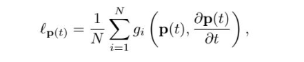

# QuantAMM

## Protocol Summary

QuantAMM is a next generation DeFi protocol launching Blockchain Traded Funds (BTFs). LPs are no longer only chasing swap fees: the weights of the pool change to take advantage of current underlying price movements and therefore can overcome MEV and Impermanent Loss. QuantAMM does this in a continuous, responsive way with advanced, fully on-chain TradFi-style strategies.


[Ethereum][Solidity][DeFi][AMM]

---

### [H-01] User can bypass the uplift Fee via transfer token to others

#### Summary
When users add liquidity through the uplift Router/hook contract, they are charged an uplift fee if the price increases after their deposit. However, this fee can be bypassed by transferring the NFT to another address and then withdrawing liquidity, which only incurs the withdrawal fee instead of the uplift fee.

#### Vulnerability Details
When a user deposits or adds liquidity, an NFT is minted for the user, and the router stores the current USD value of the assets along with the amount of their BPT tokens.

```solidity
contracts/hooks-quantamm/UpliftOnlyExample.sol:220
220:     function addLiquidityProportional(
221:         address pool,
222:         uint256[] memory maxAmountsIn,
223:         uint256 exactBptAmountOut,
224:         bool wethIsEth,
225:         bytes memory userData
226:     ) external payable saveSender(msg.sender) returns (uint256[] memory amountsIn) { 
228:         if (poolsFeeData[pool][msg.sender].length > 100) {
229:             revert TooManyDeposits(pool, msg.sender);
230:         }
231:         // Do addLiquidity operation - BPT is minted to this contract.
232:         amountsIn = _addLiquidityProportional(
233:             pool,
234:             msg.sender,
235:             address(this),
236:             maxAmountsIn,
237:             exactBptAmountOut,
238:             wethIsEth,
239:             userData
240:         );
241: 
242:         uint256 tokenID = lpNFT.mint(msg.sender);
243: 
244:         //this requires the pool to be registered with the QuantAMM update weight runner
245:         //as well as approved with oracles that provide the prices
246:         uint256 depositValue = getPoolLPTokenValue(
247:             IUpdateWeightRunner(_updateWeightRunner).getData(pool),
248:             pool,
249:             MULDIRECTION.MULDOWN
250:         );
251: 
252:         poolsFeeData[pool][msg.sender].push(
253:             FeeData({
254:                 tokenID: tokenID,
255:                 amount: exactBptAmountOut,
256:                 //this rounding favours the LP
257:                 lpTokenDepositValue: depositValue, // 0.5e18
258:                 //known use of timestamp, caveats are known.
259:                 blockTimestampDeposit: uint40(block.timestamp),
260:                 upliftFeeBps: upliftFeeBps
261:             })
262:         );
263: 
264:         nftPool[tokenID] = pool;
265:     }
```
When a user withdraws liquidity from the pool, an uplift fee is charged if the price has increased. However, this fee can be bypassed by transferring the NFT to another account. Below, we examine the function that handles NFT transfers:

```solidity
contracts/hooks-quantamm/UpliftOnlyExample.sol:579
579:     function afterUpdate(address _from, address _to, uint256 _tokenID) public {
580:         if (msg.sender != address(lpNFT)) {
581:             revert TransferUpdateNonNft(_from, _to, msg.sender, _tokenID);
582:         }
583: 
584:         address poolAddress = nftPool[_tokenID];
585: 
586:         if (poolAddress == address(0)) {
587:             revert TransferUpdateTokenIDInvaid(_from, _to, _tokenID);
588:         }
589: 
590:         int256[] memory prices = IUpdateWeightRunner(_updateWeightRunner).getData(poolAddress);
591:         uint256 lpTokenDepositValueNow = getPoolLPTokenValue(prices, poolAddress, MULDIRECTION.MULDOWN);
592: 
593:         FeeData[] storage feeDataArray = poolsFeeData[poolAddress][_from]; // 1 entry 
...
610: 
611:         if (tokenIdIndexFound) {
612:             if (_to != address(0)) {
613:                 // Update the deposit value to the current value of the pool in base currency (e.g. USD) and the block index to the current block number
614:                 //vault.transferLPTokens(_from, _to, feeDataArray[i].amount);
615:                 feeDataArray[tokenIdIndex].lpTokenDepositValue = lpTokenDepositValueNow;
616:                 feeDataArray[tokenIdIndex].blockTimestampDeposit = uint32(block.number);
617:                 feeDataArray[tokenIdIndex].upliftFeeBps = upliftFeeBps;
618: 
619:                 //actual transfer not a afterTokenTransfer caused by a burn
620:                 poolsFeeData[poolAddress][_to].push(feeDataArray[tokenIdIndex]); 
...
633:         }
634:     }
635: 

```

From the code above, it is evident that the lpTokenDepositValue is only updated to reflect the latest price, and the FeeData is stored for the receiver. Consequently, when a user withdraws, only the withdrawal fee will be applied.

Breakdown of the removeLiquidity Function:
During the withdrawal process, the current price is fetched and compared with the stored USD value.

If the difference is greater than 0, the uplift fee is applied.

Otherwise, only the withdrawal fee is charged.

```solidity
contracts/hooks-quantamm/UpliftOnlyExample.sol:434
434:     function onAfterRemoveLiquidity(
435:         address router,
436:         address pool,
437:         RemoveLiquidityKind,
438:         uint256 bptAmountIn,
439:         uint256[] memory,
440:         uint256[] memory amountsOutRaw,
441:         uint256[] memory,
442:         bytes memory userData
443:     ) public override onlySelfRouter(router) returns (bool, uint256[] memory hookAdjustedAmountsOutRaw) {
444:         address userAddress = address(bytes20(userData));
...
465:         // We only allow removeLiquidity via the Router/Hook itself so that fee is applied correctly.
466:         hookAdjustedAmountsOutRaw = amountsOutRaw;
467: 
468:         //this rounding faxvours the LP
469:         localData.lpTokenDepositValueNow = getPoolLPTokenValue(localData.prices, pool, MULDIRECTION.MULDOWN);
470: 
471:         FeeData[] storage feeDataArray = poolsFeeData[pool][userAddress];
472:         localData.feeDataArrayLength = feeDataArray.length;
473:         localData.amountLeft = bptAmountIn;
474:         for (uint256 i = localData.feeDataArrayLength - 1; i >= 0; --i) {
475:             localData.lpTokenDepositValue = feeDataArray[i].lpTokenDepositValue;
477: 
478:             localData.lpTokenDepositValueChange =
479:                 (int256(localData.lpTokenDepositValueNow) - int256(localData.lpTokenDepositValue)) /
480:                 int256(localData.lpTokenDepositValue);// @note : it returns values in bps so upto 0.9 e18 change can be 
481:             uint256 feePerLP;
482:             // if the pool has increased in value since the deposit, the fee is calculated based on the deposit value
483:             if (localData.lpTokenDepositValueChange > 0) { // @note : it will not work with bps less than 1
485:                 feePerLP =
486:                     (uint256(localData.lpTokenDepositValueChange) * (uint256(feeDataArray[i].upliftFeeBps) * 1e18)) /
487:                     10000;
488:             }
489:             // if the pool has decreased in value since the deposit, the fee is calculated based on the base value - see wp
490:             else {
491:                 //in most cases this should be a normal swap fee amount.
492:                 //there always myst be at least the swap fee amount to avoid deposit/withdraw attack surgace.
493:                 feePerLP = (uint256(minWithdrawalFeeBps) * 1e18) / 10000;
494:             
}
```
Steps to Bypass Uplift Fee
Initial Deposit: Alice deposits 10 WETH at a price of $3000. The stored lpTokenDepositValue is set to $30,000\.

Price Increase: The price of WETH increases to $3400. If Alice withdraws, the uplift fee will be applied.

NFT Transfer: Alice transfers the NFT to another address. The stored lpTokenDepositValue is updated to $34,000.

Withdrawal: Alice calls the removeLiquidityProportional function. Since the current USD value and the stored USD value are the same, no uplift fee is applied.

#### Impact
The user can bypass the uplift fee by transferring the NFT to another address. and the Withdrawal Fee according to current config is less than uplift fee.

#### Tools Used
Manual Review

#### Recommendations
When a user transfers the NFT, the best approach would be to apply the uplift fee if the price has increased.

---

### [H-02] In case of `minimumVariance` No `performUpdate` could be executed after first one

#### Summary
In minimum variance, the previous moving average is stored/packed. However, due to incorrect unpacking, no performUpdate is executed after the first one.

#### Vulnerability Details
The WeightedPool using minimum variance also stores the previous moving average. During the deployment of the weighted pool, the initial moving average is stored as part of the pool's initialization.

```solidity

contracts/rules/UpdateRule.sol:247
247:     function initialisePoolRuleIntermediateValues(
248:         address _poolAddress,
249:         int256[] memory _newMovingAverages,
250:         int256[] memory _newInitialValues,
251:         uint _numberOfAssets
252:     ) external {
253:         //initialisation is controlled during the registration process
254:         //this is to make sure no external actor can call this function
255:         require(msg.sender == _poolAddress || msg.sender == updateWeightRunner, "UNAUTH");
256:         _setInitialMovingAverages(_poolAddress, _newMovingAverages, _numberOfAssets);
257:         _setInitialIntermediateValues(_poolAddress, _newInitialValues, _numberOfAssets);
258:     }
259: 
Here, at line 256, the _setInitialMovingAverages function is called.

contracts/rules/base/QuantammMathMovingAverage.sol:67
67:     function _setInitialMovingAverages(
68:         address _poolAddress,
69:         int256[] memory _initialMovingAverages,
70:         uint _numberOfAssets
71:     ) internal {
72:         uint movingAverageLength = movingAverages[_poolAddress].length;
73: 
74:         if (movingAverageLength == 0 || _initialMovingAverages.length == _numberOfAssets) {
75:             //should be during create pool
76:             movingAverages[_poolAddress] = _quantAMMPack128Array(_initialMovingAverages);
77:         } else {
78:             revert("Invalid set moving avg");
79:         }
80:     }
```
The movingAverage values are packed into a 128 array and stored in movingAverages[_poolAddress]. These values are fetched when the performUpdate function is called, which in turn invokes CalculateNewWeights to determine the new weights for the weighted pool. The code below demonstrates how the data is unpacked to retrieve the exact moving average values:

```solidity
/contracts/rules/UpdateRule.sol:78
 78:     /// @param _absoluteWeightGuardRail the maximum weight a token can have
 79:     function CalculateNewWeights(
 80:         int256[] calldata _prevWeights,
 81:         int256[] calldata _data,
 82:         address _pool,
 83:         int256[][] calldata _parameters,
 84:         uint64[] calldata _lambdaStore,
 85:         uint64 _epsilonMax,
 86:         uint64 _absoluteWeightGuardRail
 87:     ) external returns (int256[] memory updatedWeights) {
 88:         require(msg.sender == updateWeightRunner, "UNAUTH_CALC");
 89:         
 90:         QuantAMMUpdateRuleLocals memory locals;
 91: 
 92:         locals.numberOfAssets = _prevWeights.length;
 93:         locals.nMinusOne = locals.numberOfAssets - 1;
 94:         locals.lambda = new int128[](_lambdaStore.length);
 95: 
 96:         for (locals.i; locals.i < locals.lambda.length; ) {
 97:             locals.lambda[locals.i] = int128(uint128(_lambdaStore[locals.i])); 
 98:             unchecked {
 99:                 ++locals.i;
100:             }
101:         }
102: 
103:         locals.requiresPrevAverage = _requiresPrevMovingAverage() == REQ_PREV_MAVG_VAL; 
104:         locals.intermediateMovingAverageStateLength = locals.numberOfAssets;
105: 
106:         if (locals.requiresPrevAverage) {
107:             unchecked {
108:                 locals.intermediateMovingAverageStateLength *= 2;
109:             }
110:         }
111: 
112:         locals.currMovingAverage = new int256[](locals.numberOfAssets);
113:         locals.updatedMovingAverage = new int256[](locals.numberOfAssets);
114:  @>      locals.calculationMovingAverage = new int256[](locals.intermediateMovingAverageStateLength);
115: 
116:  @>       locals.currMovingAverage = _quantAMMUnpack128Array(movingAverages[_pool], locals.numberOfAssets);
```
When the performUpdate function is called for the first time, it also stores the previous average if required. From the above code, at line 114, the new moving average will double in length if the previous average is needed. Then, at line 116, the current packed data is unpacked.

Assuming a two-asset weighted pool, the length of the packed moving average array becomes 2 due to the inclusion of previous average data, with the number of assets being 2. Let’s examine the unpacking code below.

```solidity
contracts/QuantAMMStorage.sol:350
350:     function _quantAMMUnpack128Array(
351:         int256[] memory _sourceArray,
352:         uint _targetArrayLength
353:     ) internal pure returns (int256[] memory targetArray) {
354:         // [0,1,2]
355:         require(_sourceArray.length * 2 >= _targetArrayLength, "SRC!=TGT");
356:         targetArray = new int256[](_targetArrayLength);
357:         uint targetIndex;
358:         uint sourceArrayLengthMinusOne = _sourceArray.length - 1;
359:         bool divisibleByTwo = _targetArrayLength % 2 == 0;
360:         for (uint i; i < _sourceArray.length; ) {
361:             targetArray[targetIndex] = _sourceArray[i] >> 128; 
362:             unchecked {
363:                 ++targetIndex;
364:             }
365:             if ((!divisibleByTwo && i < sourceArrayLengthMinusOne) || divisibleByTwo) {
366:                 targetArray[targetIndex] = int256(int128(_sourceArray[i]));
367:             }
368:             unchecked {
369:                 ++i;
370:                 ++targetIndex;
371:             }
372:             
373:         }
374: 
375:         if (!divisibleByTwo) {
376:             targetArray[_targetArrayLength - 1] = int256(int128(_sourceArray[sourceArrayLengthMinusOne]));
378:         }
379:     }
380: }
```

This function is expected to return unpacked data, including both the current moving average and the previous moving average. Therefore, the final length of the array should be 4. In _targetArrayLength, the number of assets is passed, which is 2 in this case. However, this unpacking function will revert with [FAIL: panic: array out-of-bounds access (0x32)].

```solidity
// SPDX-License-Identifier: GPL-3.0-or-later
​
pragma solidity ^0.8.24;
​
import "forge-std/Test.sol";
​
import { IERC20 } from "@openzeppelin/contracts/token/ERC20/IERC20.sol";
​
import { IVault } from "@balancer-labs/v3-interfaces/contracts/vault/IVault.sol";
import { IVaultErrors } from "@balancer-labs/v3-interfaces/contracts/vault/IVaultErrors.sol";
import { PoolRoleAccounts } from "@balancer-labs/v3-interfaces/contracts/vault/VaultTypes.sol";
import { MockMinimumVarianceRule } from "../../contracts/mock/mockRules/MockMinimumVarianceRule.sol";
​
import { CastingHelpers } from "@balancer-labs/v3-solidity-utils/contracts/helpers/CastingHelpers.sol";
import { ArrayHelpers } from "@balancer-labs/v3-solidity-utils/contracts/test/ArrayHelpers.sol";
import { BalancerPoolToken } from "@balancer-labs/v3-vault/contracts/BalancerPoolToken.sol";
import { BaseVaultTest } from "@balancer-labs/v3-vault/test/foundry/utils/BaseVaultTest.sol";
​
import { QuantAMMWeightedPool } from "../../contracts/QuantAMMWeightedPool.sol";
import { QuantAMMWeightedPoolFactory } from "../../contracts/QuantAMMWeightedPoolFactory.sol";
import { QuantAMMWeightedPoolContractsDeployer } from "./utils/QuantAMMWeightedPoolContractsDeployer.sol";
import { PoolSwapParams, SwapKind } from "@balancer-labs/v3-interfaces/contracts/vault/VaultTypes.sol";
import { OracleWrapper } from "@balancer-labs/v3-interfaces/contracts/pool-quantamm/OracleWrapper.sol";
import { MockUpdateWeightRunner } from "../../contracts/mock/MockUpdateWeightRunner.sol";
import { MockMomentumRule } from "../../contracts/mock/mockRules/MockMomentumRule.sol";
import { MockAntiMomentumRule } from "../../contracts/mock/mockRules/MockAntiMomentumRule.sol";
import { MockChainlinkOracle } from "../../contracts/mock/MockChainlinkOracles.sol";
​
import "@balancer-labs/v3-interfaces/contracts/pool-quantamm/IQuantAMMWeightedPool.sol";
​
contract Pool3TokenTest is QuantAMMWeightedPoolContractsDeployer, BaseVaultTest {
    using CastingHelpers for address[];
    using ArrayHelpers for *;
    uint64 public constant MAX_SWAP_FEE_PERCENTAGE = 10e16;
​
    QuantAMMWeightedPoolFactory internal quantAMMWeightedPoolFactory;
​
    function setUp() public override {
        uint delay = 3600;
        super.setUp();
        (address ownerLocal, address addr1Local, address addr2Local) = (vm.addr(1), vm.addr(2), vm.addr(3));
        owner = ownerLocal;
        vm.startPrank(owner);
        updateWeightRunner = new MockUpdateWeightRunner(owner, addr2, false);
        chainlinkOracle = _deployOracle(1e18, delay);
        chainlinkOracle2 = _deployOracle(1e18, delay);
        updateWeightRunner.addOracle(OracleWrapper(chainlinkOracle));
        updateWeightRunner.addOracle(OracleWrapper(chainlinkOracle2));
        vm.stopPrank();
        quantAMMWeightedPoolFactory = deployQuantAMMWeightedPoolFactory(
            IVault(address(vault)),
            365 days,
            "Factory v1",
            "Pool v1"
        );
    }
    function test_previous_average_revert_case() public {
        QuantAMMWeightedPoolFactory.NewPoolParams memory params = _createPoolParams();
        params._initialWeights[0] = 0.03e18;
        params._initialWeights[1] = 0.97e18;
        (address quantAMMWeightedPool, ) = quantAMMWeightedPoolFactory.create(params);
        vm.prank(owner);
        updateWeightRunner.setApprovedActionsForPool(quantAMMWeightedPool,1);
        chainlinkOracle.updateData(1e18, uint40(block.timestamp));
        chainlinkOracle2.updateData(1e18, uint40(block.timestamp));
        updateWeightRunner.performUpdate(quantAMMWeightedPool); // this one executed successfully 
        vm.expectRevert();
         vm.warp(block.timestamp+1000);
        updateWeightRunner.performUpdate(quantAMMWeightedPool); // this one will revert index out of bound
    }
    function _createPoolParams() internal returns (QuantAMMWeightedPoolFactory.NewPoolParams memory retParams) {
        PoolRoleAccounts memory roleAccounts;
        IERC20[] memory tokens = [address(dai), address(usdc)].toMemoryArray().asIERC20();
        MockMinimumVarianceRule minimumvarianceRule = new MockMinimumVarianceRule(address(updateWeightRunner));
​
        uint32[] memory weights = new uint32[]();
        weights[0] = uint32(uint256(0.5e18));
        weights[1] = uint32(uint256(0.4e18));
​
        int256[] memory initialWeights = new int256[]();
        initialWeights[0] = 0.5e18;
        initialWeights[1] = 0.4e18;
        uint256[] memory initialWeightsUint = new uint256[]();
        initialWeightsUint[0] = 0.5e18;
        initialWeightsUint[1] = 0.4e18;
​
        uint64[] memory lambdas = new uint64[]();
        lambdas[0] = 0.2e18;
       int256[][] memory parameters = new int256[][]();
            parameters[0] = new int256[]();
            parameters[0][0] = 0.6e18;
​
        address[][] memory oracles = new address[][]();
        oracles[0] = new address[]();
        oracles[1] = new address[]();
        oracles[0][0] = address(chainlinkOracle);
        oracles[1][0] = address(chainlinkOracle2);
​
        retParams = QuantAMMWeightedPoolFactory.NewPoolParams(
            "Pool With Donation",
            "PwD",
            vault.buildTokenConfig(tokens),
            initialWeightsUint,
            roleAccounts,
            MAX_SWAP_FEE_PERCENTAGE,
            address(0),
            true,
            false, // Do not disable unbalanced add/remove liquidity
            ZERO_BYTES32,
            initialWeights,
            IQuantAMMWeightedPool.PoolSettings(
                new IERC20[](2),
                IUpdateRule(minimumvarianceRule),
                oracles,
                60,
                lambdas,
                0.2e18,
                0.02e18, // absolute guard rail
                0.2e18,
                parameters,
                address(0)
            ),
            initialWeights,
            initialWeights,
            3600,
            0,
            new string[][]()
        );
    }
}
```
Run with command : `forge test --mt test_previous_average_revert_case -vvv`

#### Impact
In the case of minimum variance, where the previous average is also stored, the unpacking process will revert after the first call to the performUpdate function. This results in a DoS for all pools that use this UpdateRule.

#### Tools Used
Manual Review, Unit Testing

#### Recommendations
One of the Recommended Fix could be to handle this case as follows:

```diff
diff --git a/pkg/pool-quantamm/contracts/rules/UpdateRule.sol b/pkg/pool-quantamm/contracts/rules/UpdateRule.sol
index f495f8b..b9dbff2 100644
--- a/pkg/pool-quantamm/contracts/rules/UpdateRule.sol
+++ b/pkg/pool-quantamm/contracts/rules/UpdateRule.sol
@@ -7,7 +7,7 @@ import "./base/QuantammMathMovingAverage.sol";
 import "../UpdateWeightRunner.sol";
 import "./base/QuantammBasedRuleHelpers.sol";
 import "@balancer-labs/v3-interfaces/contracts/pool-quantamm/IUpdateRule.sol";
@@ -31,6 +31,7 @@ abstract contract UpdateRule is QuantAMMMathGuard, QuantAMMMathMovingAverage, IU
     
     string public name;
     string[] public parameterDescriptions;
+    bool isFirstTime = true;
 
     /// @dev struct to avoid stack too deep issues
     /// @notice Struct to store local variables for the update rule
@@ -102,19 +103,24 @@ abstract contract UpdateRule is QuantAMMMathGuard, QuantAMMMathMovingAverage, IU
 
         locals.requiresPrevAverage = _requiresPrevMovingAverage() == REQ_PREV_MAVG_VAL;
         locals.intermediateMovingAverageStateLength = locals.numberOfAssets; // 2
+        locals.i =locals.numberOfAssets; // using locals.i for numberOfAssets
 
-        if (locals.requiresPrevAverage) {
+        if (locals.requiresPrevAverage) {
             unchecked {
                 locals.intermediateMovingAverageStateLength *= 2; // than we need to double the array size make it 10
             }
+            // here need to check if this is not first call
+            if(!isFirstTime){
+                locals.i = locals.intermediateMovingAverageStateLength; // using local.i for number of assets
+            }
         }
+             isFirstTime = false;
 
         locals.currMovingAverage = new int256[](locals.numberOfAssets);
         locals.updatedMovingAverage = new int256[](locals.numberOfAssets);
         locals.calculationMovingAverage = new int256[](locals.intermediateMovingAverageStateLength);
 
-        locals.currMovingAverage = _quantAMMUnpack128Array(movingAverages[_pool], locals.numberOfAssets)
-
+        locals.currMovingAverage = _quantAMMUnpack128Array(movingAverages[_pool], locals.i);
```

---

### [H-03] Precision lose will not allow users to withdraw liquidity After first remove liquidity call

#### Summary
When quantAMMSwapFeeTake is greater than 0, there are certain scenarios where users will not be able to remove liquidity due to multiple instances of rounding down.

#### Vulnerability Details
Whenever a user removes liquidity, the onAfterRemoveLiquidity function checks if adminFeePercent > 0. If true, the admin fee is added back as liquidity to the weighted pool.
```solidity

/contracts/hooks-quantamm/UpliftOnlyExample.sol
527: 
528:         localData.adminFeePercent = IUpdateWeightRunner(_updateWeightRunner).getQuantAMMUpliftFeeTake();
529: 
531:         for (uint256 i = 0; i < localData.amountsOutRaw.length; i++) {
532:             uint256 exitFee = localData.amountsOutRaw[i].mulDown(localData.feePercentage);
533:             if (localData.adminFeePercent > 0) {
534:                 localData.accruedQuantAMMFees[i] = exitFee.mulDown(localData.adminFeePercent); // @audit-issue : mulDown cause precision error
535: 
536:             }
537: 
538:             localData.accruedFees[i] = exitFee - localData.accruedQuantAMMFees[i];
539:             hookAdjustedAmountsOutRaw[i] -= exitFee;
543:         }
544: 
545:         if (localData.adminFeePercent > 0) {
546:             _vault.addLiquidity(
547:                 AddLiquidityParams({
548:                     pool: localData.pool,
549:                     to: IUpdateWeightRunner(_updateWeightRunner).getQuantAMMAdmin(),
550:                     maxAmountsIn: localData.accruedQuantAMMFees, 
551:                     minBptAmountOut: localData.feeAmount.mulDown(localData.adminFeePercent) / 1e18,
552:                     kind: AddLiquidityKind.PROPORTIONAL,
553:                     userData: bytes("")
554:                 })
555:             );
```
Due to multiple rounding downs, the maxAmountsIn becomes smaller than the amountInRaw, becuase the vault rounds up as shown below.

```solidity

/contracts/Vault.sol
705:             // 1) Calculate raw amount in.
706:             {
707:                 uint256 amountInScaled18 = amountsInScaled18[i];
708:                 _ensureValidTradeAmount(amountInScaled18);
709: 
710:                 // If the value in memory is not set, convert scaled amount to raw.
711:                 if (amountsInRaw[i] == 0) {
712:                     // amountsInRaw are amounts actually entering the Pool, so we round up.
713:                     // Do not mutate in place yet, as we need them scaled for the `onAfterAddLiquidity` hook.
714:                     amountInRaw = amountInScaled18.toRawUndoRateRoundUp( // @audit its rounds up
715:                         poolData.decimalScalingFactors[i],
716:                         poolData.tokenRates[i]
717:                     );
719: 
720:                     amountsInRaw[i] = amountInRaw;
721:                 } else {
722:                     // Exact in requests will have the raw amount in memory already, so we use it moving forward and
723:                     // skip downscaling.
724:                     amountInRaw = amountsInRaw[i];
725:                 }
726:             }
727: 
728:             IERC20 token = poolData.tokens[i];
729: 
730:             // 2) Check limits for raw amounts.
731:             if (amountInRaw > params.maxAmountsIn[i]) { // @audit revert here because we roundDown the maxAmountIn and vault roundup amountInRaw 
732:                 revert AmountInAboveMax(token, amountInRaw, params.maxAmountsIn[i]);
733:             }
​```
Following case describe this issue:

Bob adds liquidity.

Alice adds liquidity.

Alice removes liquidity.

LP adds liquidity.

As a result, Bob and LP are unable to remove their liquidity.
```solidity
    function testWithdrawDOS() public {
        vm.startPrank(address(vaultAdmin));
        updateWeightRunner.setQuantAMMSwapFeeTake(0.02e18);
        vm.stopPrank();
​
​
        uint256[] memory maxAmountsIn = [uint256(2e18), uint256(2e18)].toMemoryArray();
        
        uint256 bptAmountDeposit = 2e18; 
​
        vm.startPrank(bob);
        upliftOnlyRouter.addLiquidityProportional(pool, maxAmountsIn, bptAmountDeposit, false, bytes(""));
        vm.stopPrank();
​
​
        vm.startPrank(alice);
        upliftOnlyRouter.addLiquidityProportional(pool, maxAmountsIn, bptAmountDeposit, false, bytes(""));
        vm.stopPrank();
​
​
        uint256[] memory minAmountsOut = [uint256(0), uint256(0)].toMemoryArray();
​
        vm.startPrank(alice);
        upliftOnlyRouter.removeLiquidityProportional(bptAmountDeposit, minAmountsOut, false, pool);
        vm.stopPrank();
​
        // @audit after this no one can remove liquidity
​
       vm.expectRevert();
        vm.startPrank(bob);
        upliftOnlyRouter.removeLiquidityProportional(bptAmountDeposit, minAmountsOut, false, pool);
        vm.stopPrank();
​
        vm.startPrank(lp);
        upliftOnlyRouter.addLiquidityProportional(pool, maxAmountsIn, bptAmountDeposit, false, bytes(""));
        vm.stopPrank();
​
      
​
        vm.expectRevert();
        vm.startPrank(lp);
        upliftOnlyRouter.removeLiquidityProportional(bptAmountDeposit, minAmountsOut, false, pool);
        vm.stopPrank();
        
    }
```
Run
`forge test --mt testWithdrawDOS  -vvv`
#### Impact
After the first removal of liquidity, no one else can remove their liquidity if UpliftFee is active.

#### Tools Used
Unit Testing, Manual Review

#### Recommendations
short term fix
```diff
diff --git a/pkg/pool-hooks/contracts/hooks-quantamm/UpliftOnlyExample.sol b/pkg/pool-hooks/contracts/hooks-quantamm/UpliftOnlyExample.sol
index fbf4f56..4e4c585 100644
--- a/pkg/pool-hooks/contracts/hooks-quantamm/UpliftOnlyExample.sol
+++ b/pkg/pool-hooks/contracts/hooks-quantamm/UpliftOnlyExample.sol
@@ -523,7 +523,7 @@ contract UpliftOnlyExample is MinimalRouter, BaseHooks, Ownable {
             uint256 exitFee = localData.amountsOutRaw[i].mulDown(localData.feePercentage);
 
             if (localData.adminFeePercent > 0) {
-                localData.accruedQuantAMMFees[i] = exitFee.mulDown(localData.adminFeePercent);
+                localData.accruedQuantAMMFees[i] = exitFee.mulUp(localData.adminFeePercent);
             }
```
long term fix
please do test all the edge cases which can prevent users from removing liquidity

---

### [M-01] An unintended self-transfer of an NFT will result in a DoS, preventing the user from removing liquidity.

#### Summary
A user can perform a uninteded self-transfer of their liquidity-position NFT, leading to a state inconsistency that prevents them from subsequently withdrawing their liquidity.

#### Vulnerability Details
If a user mistakenly transfers the NFT to themselves, they will not be able to remove liquidity. This happens because the initial addition and removal of FeeData in afterUpdate deletes their record from the array but does not pop the array entry, leading to an inconsistency while processing the liquidity removal.
```solidity
    function testSelfTransfer() public {
        uint256[] memory maxAmountsIn = [uint256(2e18), uint256(2e18)].toMemoryArray();
        
        vm.startPrank(bob);
        uint256 bptAmountDeposit = 2e18; 
        upliftOnlyRouter.addLiquidityProportional(pool, maxAmountsIn, bptAmountDeposit, false, bytes(""));
        upliftOnlyRouter.addLiquidityProportional(pool, maxAmountsIn, bptAmountDeposit, false, bytes(""));
        vm.stopPrank();
​
        LPNFT lpNft = upliftOnlyRouter.lpNFT();
​
        vm.startPrank(bob);
        lpNft.transferFrom(bob, bob, 1);
        vm.stopPrank();
​
        uint256[] memory minAmountsOut = [uint256(0), uint256(0)].toMemoryArray();
​
        vm.expectRevert();
        vm.startPrank(bob);
        upliftOnlyRouter.removeLiquidityProportional(bptAmountDeposit, minAmountsOut, false, pool);
        vm.stopPrank();
​
        vm.expectRevert();
        vm.startPrank(bob);
        upliftOnlyRouter.removeLiquidityProportional(bptAmountDeposit, minAmountsOut, false, pool);
        vm.stopPrank();
    }
```
#### Impact
create DoS Preventing User from Removing Liquidity.

#### Tools Used
Manual Review

#### Recommendations
Add a check to revert or disallow transfers if the from and to addresses are same

```diff 
diff --git a/pkg/pool-hooks/contracts/hooks-quantamm/UpliftOnlyExample.sol b/pkg/pool-hooks/contracts/hooks-quantamm/UpliftOnlyExample.sol
index 66c0a5e..7da60d0 100644
--- a/pkg/pool-hooks/contracts/hooks-quantamm/UpliftOnlyExample.sol
+++ b/pkg/pool-hooks/contracts/hooks-quantamm/UpliftOnlyExample.sol
@@ -189,6 +189,8 @@ contract UpliftOnlyExample is MinimalRouter, BaseHooks, Ownable {
     error TransferUpdateTokenIDInvaid(address from, address to, uint256 tokenId);
 
     error ZeroAmountProvided(uint256 amount);
+    
+    error SelfTransfer();
 
     modifier onlySelfRouter(address router) {
         _ensureSelfRouter(router);
@@ -585,7 +587,9 @@ contract UpliftOnlyExample is MinimalRouter, BaseHooks, Ownable {
         if (msg.sender != address(lpNFT)) {
             revert TransferUpdateNonNft(_from, _to, msg.sender, _tokenID);
         }
-
+        if (_from == _to){
+            revert SelfTransfer();
+        }
```
If self-transfers must be allowed, ensure the contract logic correctly updates ownership and internal state even when the NFT is transferred to the same address.

---

### [M-02] The uplift Fee can apply if price increase by up to 99%

#### Summary
The purpose of the Router/hook contract is to charge a fee when a user removes liquidity if the price has increased after the deposit. However, due to incorrect scaling, the uplift fee will not be applied if the price increases by up to 99%.

#### Vulnerability Details
When a user deposits assets, the router/hook contract fetches the price from the oracle, calculates the deposit value, and stores it in the FeeData mapping.
```solidity

contracts/hooks-quantamm/UpliftOnlyExample.sol:249
249:         //this requires the pool to be registered with the QuantAMM update weight runner
250:         //as well as approved with oracles that provide the prices
251:         uint256 depositValue = getPoolLPTokenValue(
252:             IUpdateWeightRunner(_updateWeightRunner).getData(pool),
253:             pool,
254:             MULDIRECTION.MULDOWN
255:         );
256: 
257:         poolsFeeData[pool][msg.sender].push(
258:             FeeData({
259:                 tokenID: tokenID,
260:                 amount: exactBptAmountOut,
261:                 //this rounding favours the LP
262:                 lpTokenDepositValue: depositValue, // 0.5e18
263:                 //known use of timestamp, caveats are known.
264:                 blockTimestampDeposit: uint40(block.timestamp),
265:                 upliftFeeBps: upliftFeeBps
266:             })
267:         );
268: 
```
At line 262, the current USD value is stored. When a user removes liquidity, the asset's price is recalculated and compared with the stored price. If there is an increase in price, the uplift fee is applied.
```solidity
contracts/hooks-quantamm/UpliftOnlyExample.sol:474
474:         localData.lpTokenDepositValueNow = getPoolLPTokenValue(localData.prices, pool, MULDIRECTION.MULDOWN);
475: 
476:         FeeData[] storage feeDataArray = poolsFeeData[pool][userAddress];
477:         localData.feeDataArrayLength = feeDataArray.length;
478:         localData.amountLeft = bptAmountIn;
479:         for (uint256 i = localData.feeDataArrayLength - 1; i >= 0; --i) {
480:             localData.lpTokenDepositValue = feeDataArray[i].lpTokenDepositValue;
483:             localData.lpTokenDepositValueChange =
484:                 ((int256(localData.lpTokenDepositValueNow) - int256(localData.lpTokenDepositValue)) *1e18) /
485:                 int256(localData.lpTokenDepositValue);
486:             uint256 feePerLP;
487:             // if the pool has increased in value since the deposit, the fee is calculated based on the deposit value
488:             if (localData.lpTokenDepositValueChange > 0) { 
491:                 feePerLP =
492:                     (uint256(localData.lpTokenDepositValueChange) * (uint256(feeDataArray[i].upliftFeeBps) * 1e18)) /
493:                     10000;
494:             }
495:             // if the pool has decreased in value since the deposit, the fee is calculated based on the base value - see wp
496:             else {
497:                 //in most cases this should be a normal swap fee amount.
498:                 //there always myst be at least the swap fee amount to avoid deposit/withdraw attack surgace.
499:                 feePerLP = (uint256(minWithdrawalFeeBps) * 1e18) / 10000;
500:             }
```
The issue here is that if the price increases by 99%, no uplift fee will be applied.

Let’s suppose:
​
1. Deposit price at time of deposit = `1e18`, so deposit value = `1e18`.
2. Price at withdrawal time = `1.99e18`, so deposit value = `1.99e18`.
3. Calculation: `(1.99e18 - 1e18) / 1e18 = 0.99e18`.
​
Since Solidity downcasts `0.99e18` to `0`, no uplift fee will be applied.  
Coded POC :
```solidity
    function test_price_increase_but_no_uplift_fee_applied() public {
        // @audit-issue : poc for issue 1 where the price increate upto 99% but no uplift fee applied
        // Add liquidity so bob has BPT to remove liquidity.
        uint256[] memory maxAmountsIn = [dai.balanceOf(bob), usdc.balanceOf(bob)].toMemoryArray();
        vm.prank(bob);
        upliftOnlyRouter.addLiquidityProportional(pool, maxAmountsIn, bptAmount, false, bytes(""));
        vm.stopPrank();
​
        int256[] memory prices = new int256[]();
        for (uint256 i = 0; i < tokens.length; ++i) {
            prices[i] = int256(i) * 1.99e18; // increate the price by 99%
        }
        updateWeightRunner.setMockPrices(pool, prices);
​
        uint256 nftTokenId = 0;
        uint256[] memory minAmountsOut = [uint256(0), uint256(0)].toMemoryArray();
​
        BaseVaultTest.Balances memory balancesBefore = getBalances(bob);
​
        vm.startPrank(bob);
        upliftOnlyRouter.removeLiquidityProportional(bptAmount, minAmountsOut, false, pool);
        vm.stopPrank();
        BaseVaultTest.Balances memory balancesAfter = getBalances(bob);
​
        uint256 feeAmountAmountPercent = ((bptAmount / 2) *
            ((uint256(upliftOnlyRouter.minWithdrawalFeeBps()) * 1e18) / 10000)) / ((bptAmount / 2));
        uint256 amountOut = (bptAmount / 2).mulDown((1e18 - feeAmountAmountPercent));
​
        // Bob gets original liquidity with no fee applied because of precision loss.
        assertEq(
            balancesAfter.bobTokens[daiIdx] - balancesBefore.bobTokens[daiIdx],
            amountOut,
            "bob's DAI amount is wrong"
        );
        assertEq(
            balancesAfter.bobTokens[usdcIdx] - balancesBefore.bobTokens[usdcIdx],
            amountOut,
            "bob's USDC amount is wrong"
        );
​
        // Pool balances decrease by amountOut.
        assertEq(
            balancesBefore.poolTokens[daiIdx] - balancesAfter.poolTokens[daiIdx],
            amountOut,
            "Pool's DAI amount is wrong"
        );
        assertEq(
            balancesBefore.poolTokens[usdcIdx] - balancesAfter.poolTokens[usdcIdx],
            amountOut,
            "Pool's USDC amount is wrong"
        );
​
        //As the bpt value taken in fees is readded to the pool under the router address, the pool supply should remain the same
        // assertEq(balancesBefore.poolSupply - balancesAfter.poolSupply, bptAmount, "BPT supply amount is wrong");
​
        // Same happens with Vault balances: decrease by amountOut.
        assertEq(
            balancesBefore.vaultTokens[daiIdx] - balancesAfter.vaultTokens[daiIdx],
            amountOut,
            "Vault's DAI amount is wrong"
        );
        assertEq(
            balancesBefore.vaultTokens[usdcIdx] - balancesAfter.vaultTokens[usdcIdx],
            amountOut,
            "Vault's USDC amount is wrong"
        );
​
        // Hook balances remain unchanged.
        assertEq(balancesBefore.hookTokens[daiIdx], balancesAfter.hookTokens[daiIdx], "Hook's DAI amount is wrong");
        assertEq(balancesBefore.hookTokens[usdcIdx], balancesAfter.hookTokens[usdcIdx], "Hook's USDC amount is wrong");
        assertEq(upliftOnlyRouter.getUserPoolFeeData(pool, bob).length, 0, "bptAmount mapping should be 0");
        assertEq(
            BalancerPoolToken(pool).balanceOf(address(upliftOnlyRouter)),
            0,
            "upliftOnlyRouter should hold no BPT"
        );
        assertEq(balancesAfter.bobBpt, 0, "bob should not hold any BPT");
    }
```
run with command : `forge test --mt test_price_increase_but_no_uplift_fee_applied`

#### Impact
Due to the incorrect calculation, no uplift fee will be applied even if the price increases by up to 99%.

#### Tools Used
Manual Review

#### Recommendations
The best solution for this issue could be to scale the value by 1e18 and then divide by 1e18 at the final step, as shown below:

```diff 
@@ -474,17 +479,17 @@ contract UpliftOnlyExample is MinimalRouter, BaseHooks, Ownable {
         for (uint256 i = localData.feeDataArrayLength - 1; i >= 0; --i) {
             localData.lpTokenDepositValue = feeDataArray[i].lpTokenDepositValue;
             console.log("localData.lpTokenDepositValue" , uint256(localData.lpTokenDepositValue));
-
+            //i.e => (1.99e18 - 1e18)*1e18/1e18 =>0.99e18 
             localData.lpTokenDepositValueChange =
-                (int256(localData.lpTokenDepositValueNow) - int256(localData.lpTokenDepositValue)) /
-                int256(localData.lpTokenDepositValue);
+                ((int256(localData.lpTokenDepositValueNow) - int256(localData.lpTokenDepositValue)) * 1e18) /
+                int256(localData.lpTokenDepositValue); // now lpTokenDepositValueChange in 1e18 scale
             uint256 feePerLP;
             // if the pool has increased in value since the deposit, the fee is calculated based on the deposit value
             if (localData.lpTokenDepositValueChange > 0) { // @note : it will not work with bps less than 1
-                console.log("UpLift Fee Applied");
+                // i.e (990000000000000000 * 5000 * 1e18 / 10000) / 1e18 => 0.45e18 which is exaclty 50% per profit
                 feePerLP =
-                    (uint256(localData.lpTokenDepositValueChange) * (uint256(feeDataArray[i].upliftFeeBps) * 1e18)) /
-                    10000;
+                    ((uint256(localData.lpTokenDepositValueChange) * (uint256(feeDataArray[i].upliftFeeBps) * 1e18)) /
+                    10000)/1e18;
```

---

### [M-03] Reuse of the Same Variable for Uplift Fee and Swap Fee

#### Summary
The protocol charges both a swapFee and an upliftFee, each managed through its own setter function. However, both setter functions update the same variable, quantAMMSwapFeeTake, leading to inaccuracies in fee handling.

#### Vulnerability Details
By using the same variable for two different types of fees (upliftFee and swapFee), any updates to one fee will directly affect the other. This design prevents the quantAmmAdmin from setting distinct values for each fee, causing unintended fee configurations.
Let's review the Swapfee Setter Function.
```solidity

contracts/UpdateWeightRunner.sol:126
126:     function setQuantAMMSwapFeeTake(uint256 _quantAMMSwapFeeTake) external override {
127:         require(msg.sender == quantammAdmin, "ONLYADMIN");
128:         require(_quantAMMSwapFeeTake <= 1e18, "Swap fee must be less than 100%");
129:         uint256 oldSwapFee = quantAMMSwapFeeTake;
130:         quantAMMSwapFeeTake = _quantAMMSwapFeeTake;
133:     }
134: 
```
Here, we set _quantAMMSwapFeeTake, which can also be configured using the setQuantAMMUpliftFeeTake function.
```solidity
contracts/UpdateWeightRunner.sol:141
141:     function setQuantAMMUpliftFeeTake(uint256 _quantAMMUpliftFeeTake) external{
142:         require(msg.sender == quantammAdmin, "ONLYADMIN");
143:         require(_quantAMMUpliftFeeTake <= 1e18, "Uplift fee must be less than 100%");
144:         uint256 oldSwapFee = quantAMMSwapFeeTake;
145:         quantAMMSwapFeeTake = _quantAMMUpliftFeeTake;
```
Consider the following scenario:
```
The quantAMM admin sets the upliftFee to 50%, resulting in _quantAMMSwapFeeTake = 0.5e18.

The quantAMM admin then sets the swapFee to 20%, updating _quantAMMSwapFeeTake = 0.2e18.

When a user removes liquidity, the getQuantAMMUpliftFeeTake function will return 0.2e18.

This creates a 30% fee loss for the protocol. However, on the flip side it also translates to a loss for the end user.
```
#### Impact
Using the same variable for both upliftFee and swapFee can result in a loss, either for the protocol or the end user.

#### Tools Used
Manual Review

#### Recommendations
To avoid conflicts and potential losses, create a dedicated variable for the swap fee (e.g., swapFeeBps) instead of reusing upliftFeeBps for multiple fee types.
```diff
--- a/pkg/pool-quantamm/contracts/UpdateWeightRunner.sol
+++ b/pkg/pool-quantamm/contracts/UpdateWeightRunner.sol
@@ -122,6 +122,7 @@ contract UpdateWeightRunner is Ownable2Step, IUpdateWeightRunner {
 
     /// @notice The % of the total swap fee that is allocated to the protocol for running costs. 
     uint256 public quantAMMSwapFeeTake = 0.5e18; // @note Fee set to 50% in init 
+    uint256 public quantAMMUpliftFeeTake = 0.3e18;
 
     function setQuantAMMSwapFeeTake(uint256 _quantAMMSwapFeeTake) external override {
         require(msg.sender == quantammAdmin, "ONLYADMIN");
@@ -141,10 +142,10 @@ contract UpdateWeightRunner is Ownable2Step, IUpdateWeightRunner {
     function setQuantAMMUpliftFeeTake(uint256 _quantAMMUpliftFeeTake) external{
         require(msg.sender == quantammAdmin, "ONLYADMIN");
         require(_quantAMMUpliftFeeTake <= 1e18, "Uplift fee must be less than 100%");
-        uint256 oldSwapFee = quantAMMSwapFeeTake;
-        quantAMMSwapFeeTake = _quantAMMUpliftFeeTake;
+        uint256 oldUpliftFee = quantAMMUpliftFeeTake;
+        quantAMMUpliftFeeTake = _quantAMMUpliftFeeTake;
 
-        emit UpliftFeeTakeSet(oldSwapFee, _quantAMMUpliftFeeTake);
+        emit UpliftFeeTakeSet(oldUpliftFee, _quantAMMUpliftFeeTake);
​
     function getQuantAMMUpliftFeeTake() external view returns (uint256){
-        return quantAMMSwapFeeTake;
+        return quantAMMUpliftFeeTake;
     }
```

---

### [M-04] formula Deviation from White Paper and Weighted Pool `performUpdate` unintended revert

#### Summary
The White Paper states that there should be no difference in the calculation of scaler and vector values across formulas. Additionally, during the unguarded weights stage, the protocol should allow negative weights, as the guard weight ensures final weights validity.

However, for vector kappa values, the performUpdate function reverts when it theoretically should not. While a valid revert for a single performUpdate is expected behavior, this particular revert should not be treated as default/valid behavior.

#### Vulnerability Details
The White Paper mentions that a strategy can utilize either scalar or vector kappa values. The primary difference lies in implementation complexity, as vector kappa values require an additional SLOAD operation and a nested loop for processing.
White Paper reference





The same formula is applied for both scaler and vector kappa values, ensuring uniformity in calculations regardless of the type of kappa value used.
Formula
The current strategy algorithm supports both short and long positions. However, the additional check in the implementation, as shown in the code below, prevents the weighted pool from functioning with long/short positions if the unguarded weights return negative values after a price change.

```solidity
contracts/rules/AntimomentumUpdateRule.sol:100
100:         newWeightsConverted = new int256[](_prevWeights.length);
101:         if (locals.kappa.length == 1) {
102:             locals.normalizationFactor /= int256(_prevWeights.length);
103:             // w(t − 1) + κ ·(ℓp(t) − 1/p(t) · ∂p(t)/∂t)
104: 
105:             for (locals.i = 0; locals.i < _prevWeights.length; ) {
106:                 int256 res = int256(_prevWeights[locals.i]) +
107:                     int256(locals.kappa[0]).mul(locals.normalizationFactor - locals.newWeights[locals.i]); 
108:                 newWeightsConverted[locals.i] = res; 
110:                 unchecked {
111:                     ++locals.i;
112:                 }
113:             }
114:         } else {
115:             for (locals.i = 0; locals.i < locals.kappa.length; ) {
116:                 locals.sumKappa += locals.kappa[locals.i];
117:                 unchecked {
118:                     ++locals.i;
119:                 }
120:             }
121: 
122:             locals.normalizationFactor = locals.normalizationFactor.div(locals.sumKappa);
123:             
124:             for (locals.i = 0; locals.i < _prevWeights.length; ) {
125:                 // w(t − 1) + κ ·(ℓp(t) − 1/p(t) · ∂p(t)/∂t)
126:                 int256 res = int256(_prevWeights[locals.i]) +
127:                     int256(locals.kappa[locals.i]).mul(locals.normalizationFactor - locals.newWeights[locals.i]);
128:                 require(res >= 0, "Invalid weight"); // @audit : no valid revert
129:                 newWeightsConverted[locals.i] = res;
130:                 unchecked {
131:                     ++locals.i;
132:                 }
133:             }
134:         }
135: 
136:         return newWeightsConverted;
```
The following POC demonstrates how the algorithm behaves differently when using scaler versus vector kappa values.

```solidity
// SPDX-License-Identifier: GPL-3.0-or-later
​
pragma solidity ^0.8.24;
​
import "forge-std/Test.sol";
​
import { IERC20 } from "@openzeppelin/contracts/token/ERC20/IERC20.sol";
​
import { IVault } from "@balancer-labs/v3-interfaces/contracts/vault/IVault.sol";
import { IVaultErrors } from "@balancer-labs/v3-interfaces/contracts/vault/IVaultErrors.sol";
import { PoolRoleAccounts } from "@balancer-labs/v3-interfaces/contracts/vault/VaultTypes.sol";
​
import { CastingHelpers } from "@balancer-labs/v3-solidity-utils/contracts/helpers/CastingHelpers.sol";
import { ArrayHelpers } from "@balancer-labs/v3-solidity-utils/contracts/test/ArrayHelpers.sol";
import { BalancerPoolToken } from "@balancer-labs/v3-vault/contracts/BalancerPoolToken.sol";
import { BaseVaultTest } from "@balancer-labs/v3-vault/test/foundry/utils/BaseVaultTest.sol";
​
import { QuantAMMWeightedPool } from "../../contracts/QuantAMMWeightedPool.sol";
import { QuantAMMWeightedPoolFactory } from "../../contracts/QuantAMMWeightedPoolFactory.sol";
import { QuantAMMWeightedPoolContractsDeployer } from "./utils/QuantAMMWeightedPoolContractsDeployer.sol";
import { PoolSwapParams, SwapKind } from "@balancer-labs/v3-interfaces/contracts/vault/VaultTypes.sol";
import { OracleWrapper } from "@balancer-labs/v3-interfaces/contracts/pool-quantamm/OracleWrapper.sol";
import { MockUpdateWeightRunner } from "../../contracts/mock/MockUpdateWeightRunner.sol";
import { MockMomentumRule } from "../../contracts/mock/mockRules/MockMomentumRule.sol";
import { MockAntiMomentumRule } from "../../contracts/mock/mockRules/MockAntiMomentumRule.sol";
import { MockChainlinkOracle } from "../../contracts/mock/MockChainlinkOracles.sol";
​
import "@balancer-labs/v3-interfaces/contracts/pool-quantamm/IQuantAMMWeightedPool.sol";
​
contract QuantAMMWeightedPoolRevertCase is QuantAMMWeightedPoolContractsDeployer, BaseVaultTest {
    using CastingHelpers for address[];
    using ArrayHelpers for *;
​
    uint256 internal daiIdx;
    uint256 internal usdcIdx;
​
    // Maximum swap fee of 10%
    uint64 public constant MAX_SWAP_FEE_PERCENTAGE = 10e16;
​
    QuantAMMWeightedPoolFactory internal quantAMMWeightedPoolFactory;
​
    function setUp() public override {
        uint delay = 3600;
​
        super.setUp();
        (address ownerLocal, address addr1Local, address addr2Local) = (vm.addr(1), vm.addr(2), vm.addr(3));
        owner = ownerLocal;
        addr1 = addr1Local;
        addr2 = addr2Local;
        // Deploy UpdateWeightRunner contract
        vm.startPrank(owner);
        updateWeightRunner = new MockUpdateWeightRunner(owner, addr2, false);
​
        chainlinkOracle = _deployOracle(1e18, delay);
        chainlinkOracle2 = _deployOracle(1e18, delay); // initial Price
​
        updateWeightRunner.addOracle(OracleWrapper(chainlinkOracle));
        updateWeightRunner.addOracle(OracleWrapper(chainlinkOracle2));
​
        vm.stopPrank();
​
        quantAMMWeightedPoolFactory = deployQuantAMMWeightedPoolFactory(
            IVault(address(vault)),
            365 days,
            "Factory v1",
            "Pool v1"
        );
        vm.label(address(quantAMMWeightedPoolFactory), "quantamm weighted pool factory");
​
        (daiIdx, usdcIdx) = getSortedIndexes(address(dai), address(usdc));
    }
    function testQuantAMMWeightedPoolGetNormalizedWeightsInitial() public {
    //===================================Works Fine=============================================================//
        QuantAMMWeightedPoolFactory.NewPoolParams memory params = _createPoolParams(true,ZERO_BYTES32);
        params._initialWeights[0] = 0.80e18; // 80%
        params._initialWeights[1] = 0.20e18; // 20%
​
        (address quantAMMWeightedPool, ) = quantAMMWeightedPoolFactory.create(params);
​
        uint256[] memory weights = QuantAMMWeightedPool(quantAMMWeightedPool).getNormalizedWeights();
​
        vm.prank(owner);
        updateWeightRunner.setApprovedActionsForPool(quantAMMWeightedPool,1);
        
        updateWeightRunner.performUpdate(quantAMMWeightedPool);
​
        chainlinkOracle.updateData(0.9e18, uint40(block.timestamp));
        chainlinkOracle2.updateData(2.5e18, uint40(block.timestamp)); // price increase by 150% which is valid price change but it works fine
         
        // Move forward 10 blocks
        vm.warp(block.timestamp+1000);
        updateWeightRunner.performUpdate(quantAMMWeightedPool);
​
       uint256[] memory weightsData = QuantAMMWeightedPool(quantAMMWeightedPool).getNormalizedWeights();
​
        assertNotEq(weightsData[0],uint256(params._initialWeights[0]));
        assertNotEq(weightsData[1],uint256(params._initialWeights[1]));
​
// =========================================Unintended Revert========================================================
​
        params = _createPoolParams(false,bytes32("TheKhans"));
        params._initialWeights[0] = 0.80e18;
        params._initialWeights[1] = 0.20e18;
        ( quantAMMWeightedPool, ) = quantAMMWeightedPoolFactory.create(params);
        weights = QuantAMMWeightedPool(quantAMMWeightedPool).getNormalizedWeights();
        vm.prank(owner);
        updateWeightRunner.setApprovedActionsForPool(quantAMMWeightedPool,1);
        updateWeightRunner.performUpdate(quantAMMWeightedPool);
        chainlinkOracle.updateData(0.9e18, uint40(block.timestamp));
        chainlinkOracle2.updateData(2.5e18, uint40(block.timestamp));// price increase by 150% which is valid price change here it will revert.
        // Move forward 10 blocks
        vm.warp(block.timestamp+1000);
        vm.expectRevert();
        updateWeightRunner.performUpdate(quantAMMWeightedPool);
​
    }
​
​
    function _createPoolParams(bool useScalerKappa,bytes32 salt) internal returns (QuantAMMWeightedPoolFactory.NewPoolParams memory retParams) {
        PoolRoleAccounts memory roleAccounts;
        IERC20[] memory tokens = [address(dai), address(usdc)].toMemoryArray().asIERC20();
        MockAntiMomentumRule momentumRule = new MockAntiMomentumRule(address(updateWeightRunner));
​
        uint32[] memory weights = new uint32[]();
        weights[0] = uint32(uint256(0.5e18));
        weights[1] = uint32(uint256(0.5e18));
​
        int256[] memory initialWeights = new int256[]();
        initialWeights[0] = 0.5e18;
        initialWeights[1] = 0.5e18;
        uint256[] memory initialWeightsUint = new uint256[]();
        initialWeightsUint[0] = 0.5e18;
        initialWeightsUint[1] = 0.5e18;
​
        uint64[] memory lambdas = new uint64[]();
        lambdas[0] = 0.2e18;
        int256[][] memory parameters;
        if(!useScalerKappa){
            parameters = new int256[][]();
            parameters[0] = new int256[]();
            parameters[0][0] = 0.6e18;
            parameters[0][1] = 0.6e18;
        }else{
            parameters = new int256[][]();
            parameters[0] = new int256[]();
            parameters[0][0] = 0.6e18;
        }
        address[][] memory oracles = new address[][]();
        oracles[0] = new address[]();
        oracles[1] = new address[]();
        oracles[0][0] = address(chainlinkOracle);
        oracles[1][0] = address(chainlinkOracle2);
​
        retParams = QuantAMMWeightedPoolFactory.NewPoolParams(
            "Pool With Donation",
            "PwD",
            vault.buildTokenConfig(tokens),
            initialWeightsUint,
            roleAccounts,
            MAX_SWAP_FEE_PERCENTAGE,
            address(0),
            true,
            false, // Do not disable unbalanced add/remove liquidity
            salt, // salt
            initialWeights,
            IQuantAMMWeightedPool.PoolSettings(
                new IERC20[](2),
                IUpdateRule(momentumRule),
                oracles,
                60,
                lambdas,
                0.2e18,
                0.02e18, // absolute guard rail
                0.2e18,
                parameters,
                address(0)
            ),
            initialWeights,
            initialWeights,
            3600,
            0,
            new string[][]()
        );
    }
}
```
​
Run it with `forge test --mt testQuantAMMWeightedPoolGetNormalizedWeightsInitial -vvv`

#### Impact
In the case of vector kappa, the weights are not updated and continue using the old values, which is incorrect given the latest price changes. However, with single kappa, the update proceeds as expected, reflecting the new prices.

#### Tools Used
Manual Review, Unit Testing

#### Recommendations
It is recommended to remove the check require(res >= 0, "Invalid weight"); from all currently implemented strategies/algorithms. This change will ensure compatibility with scenarios where unguarded weights may temporarily result in negative values, allowing the system to proceed as intended.

